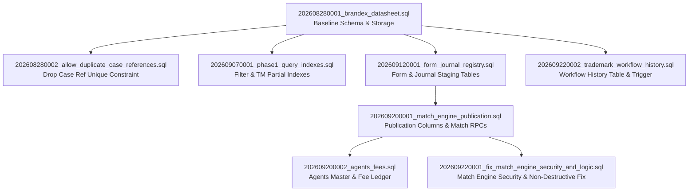

> **Phase 0 correction — 25 September 2026:** This is a historical report, not current acceptance evidence. Its completion, test, role, payment and UI claims are superseded by [Project Truth](docs/PROJECT_TRUTH.md) and [canonical business rules](docs/WORKFLOW_BUSINESS_RULES.md). Stage 2 payment is NOT required for agent assignment; Stage 1 payment gates Stage 2, and Stage 2 payment gates Stage 3. Intended active roles are Admin + Viewer; Editor remains active in the current implementation. Timers are internal business rules, not verified statutory deadlines. Do not execute the historical recommendations below as a roadmap.

# Supabase SQL Deep Architecture Audit

**Brandex Database CMS**  
**Audit Type:** Strict Read-Only Database & Migration Architecture Inspection  
**Audit Date:** 22 September 2026  
**Auditor:** AI Pair Programming Architect (Antigravity)  
**Primary Directory Inspected:** `supabase/` (All 8 ordered SQL migrations, Edge Functions, configuration)  
**Cross-References:** `WORKFLOW_V2_ARCHITECTURE_AUDIT.md`, `API_BUSINESS_LOGIC_AUDIT.md`  
**Rule of Authority:** In any discrepancy between previous markdown reports and the actual SQL definitions, the **SQL source code is the ultimate ground truth**.

---

## 1. Audit Objective

The objective of this deep audit is to recursively inspect the entire `supabase/` directory, analyze every historical and active SQL migration chronologically from repository inception to the current state, and establish the complete, factual database architecture of the Brandex Database CMS.

This audit builds the actual database source-of-truth from raw SQL before any V2 migration, schema modification, or workflow transition rule is designed or executed.

### Cross-Reference Discrepancy & Conflict Analysis

Two prior documents were cross-referenced during this audit:
1. `WORKFLOW_V2_ARCHITECTURE_AUDIT.md`
2. `API_BUSINESS_LOGIC_AUDIT.md`

| Prior Report Assertion | Actual SQL Source-of-Truth | Factual Conflict Resolution |
| :--- | :--- | :--- |
| **Workflow Stages:** Stated that `STATUS_WORKFLOW` defines allowed stages and sub-stages. | `trademarks.status` and `trademarks.sub_status` are unconstrained `TEXT` columns in Postgres. There are **zero `CHECK` constraints** and **zero enums** on case statuses. | **SQL Wins.** The database enforces no stages or sub-stages whatsoever. Any arbitrary string can be written directly to `status` or `sub_status`. |
| **Stage 1 Sub-stages:** Highlighted that "Filing" was missing from Stage 1 in `api.ts`. | In Postgres, `sub_status` accepts any text value, including `'Filing'`. No database migration is needed to permit "Filing"; only TypeScript dictionaries and triggers require alignment. | **SQL Wins.** Database column is generic `TEXT`. |
| **Workflow History:** Stated that history tracking was added in migration 8. | Verified in `202609220002_trademark_workflow_history.sql`. The trigger correctly logs transitions when `(old.status IS DISTINCT FROM new.status) OR (old.sub_status IS DISTINCT FROM new.sub_status)`. | **Consistent.** Both agree. Trigger is purely passive/logging and does not restrict transitions. |
| **Match Engine Safety:** Stated that Match Engine functions were updated for security. | Verified in `202609220001_fix_match_engine_security_and_logic.sql`. `run_journal_match()` and `run_form_match()` enforce role checks, and destructive `SET tm5 = false...` was completely removed. | **Consistent.** Production RPCs in migration 7 override the vulnerable definitions in migration 5. |
| **Payment Registry:** Hypothesized a potential `payment_registry` table or lookup mechanism. | Deep SQL search across all 8 migrations confirms **zero payment registry tables, zero client payment columns, and zero payment lookup RPCs**. | **SQL Wins.** The database possesses no client payment architecture. `agent_fees` tracks external legal agent billing, not client stage payments. |

---

## 2. Migration Inventory & Dependency Map

Every migration in `supabase/migrations/` was inspected chronologically from initial baseline to the latest commit.

### Table 2.1: Chronological Migration Catalog

| Order | Migration File | Date / Version | Purpose | Objects Created / Altered | Dependencies |
| :--- | :--- | :--- | :--- | :--- | :--- |
| **01** | `202608280001_brandex_datasheet.sql` | 2026-08-28 | Initial Production Baseline | Tables: `profiles`, `clients`, `trademarks`, `trademark_files`, `audit_logs`, `sheet_sync_outbox`. Enums: `brandex_role`, `file_category`, `sheet_sync_action`, `sheet_sync_state`. Functions: `handle_new_user()`, `current_brandex_role()`, `set_updated_metadata()`, `audit_and_queue_trademark()`. Triggers: `auth_user_created`, `trademarks_set_updated_metadata`, `trademarks_audit_and_sync`. Storage bucket: `trademark-files`. | None (Base) |
| **02** | `202608280002_allow_duplicate_case_references.sql` | 2026-08-28 | Support Legacy Sheet Duplicates | Alter table: `trademarks` (drops unique constraint `trademarks_type_client_code_case_number_key`). Index: `trademarks_case_reference_idx` on `(type, client_code, case_number)`. | Migration 01 |
| **03** | `202609070001_phase1_query_indexes.sql` | 2026-09-07 | Query Optimization & Filter Indexes | Indexes on `trademarks`: `trademarks_datasheet_order_idx`, `trademarks_filing_date_idx`, `trademarks_sub_status_idx`, `trademarks_nice_class_idx`, `trademarks_case_type_idx`. Partial indexes: `trademarks_tm5_true_idx` through `tm56_true_idx`. | Migration 01 |
| **04** | `202609120001_form_journal_registry.sql` | 2026-09-12 | Admin CSV Registry Tables | Tables: `form_registry`, `journal_registry`. Constraints: `form_registry_dedupe`, `journal_registry_dedupe`. Indexes: `form_registry_tm_norm_idx`, `form_registry_form_type_idx`, `journal_registry_app_norm_idx`, `journal_registry_journal_no_idx`. RLS policies. | Migration 01 |
| **05** | `202609200001_match_engine_publication.sql` | 2026-09-20 | Publication Fields & Match Engine RPCs | Alter table: `trademarks` (adds `publication_date`, `opposition_deadline`, `demand_note_received`, `demand_note_date`). Indexes: `trademarks_publication_date_idx`, `trademarks_opposition_deadline_idx`. Functions (RPCs): `run_journal_match()`, `run_form_match()`. | Migration 04 |
| **06** | `202609200002_agents_fees.sql` | 2026-09-20 | Agents Master & Case Fee Ledger | Tables: `agents`, `agent_fees`. View: `agent_summary`. Triggers: `agents_set_updated_at`, `agent_fees_set_updated_at`. Function: `set_agents_updated_at()`. Indexes and RLS policies. | Migration 05 |
| **07** | `202609220001_fix_match_engine_security_and_logic.sql` | 2026-09-22 | Security & Logic Fix on Match Engine | Alter functions (RPCs): `run_journal_match()` (enforces role check), `run_form_match()` (enforces role check and removes destructive reset of TM flags). | Migration 05 |
| **08** | `202609220002_trademark_workflow_history.sql` | 2026-09-22 | Case Workflow History Ledger | Table: `trademark_workflow_history`. Index: `trademark_workflow_history_idx`. Function: `trademarks_workflow_history_trigger()`. Trigger: `trademarks_workflow_history_trigger` on `trademarks`. RLS policy. | Migration 01 |

---

### Detailed Chronological Migration Dossiers

#### Migration 01: `202608280001_brandex_datasheet.sql`
- **Date / Version:** 2026-08-28
- **Purpose:** Foundational database baseline establishing user profiles, client registry, core trademark table, file attachments metadata, audit trail, Google Sheets synchronization queue, and private object storage bucket.
- **Tables Created:**
  - `public.profiles`
  - `public.clients`
  - `public.trademarks`
  - `public.trademark_files`
  - `public.audit_logs`
  - `public.sheet_sync_outbox`
- **Columns Added / Changed:** Initial schema establishment (see Table Inventory).
- **Indexes Created:**
  - `trademarks_updated_at_idx` on `public.trademarks (updated_at desc)`
  - `trademarks_tm_number_idx` on `public.trademarks (tm_cpr_number)`
  - `trademarks_client_code_idx` on `public.trademarks (client_code)`
  - `trademarks_case_reference_idx` on `public.trademarks (type, client_code, case_number)`
  - `trademarks_status_idx` on `public.trademarks (status)`
  - `trademarks_agent_idx` on `public.trademarks (agent)`
  - `trademarks_city_idx` on `public.trademarks (city)`
  - `trademarks_application_name_search_idx` on `public.trademarks using gin (to_tsvector('simple', application_name))`
  - `trademark_files_record_idx` on `public.trademark_files (trademark_id, category)`
  - `audit_logs_changed_at_idx` on `public.audit_logs (changed_at desc)`
  - `audit_logs_record_idx` on `public.audit_logs (trademark_id, changed_at desc)`
  - `sheet_sync_pending_idx` on `public.sheet_sync_outbox (state, created_at) where state in ('pending', 'failed')`
- **Constraints:**
  - `trademarks.type`: `check (type in ('X', 'A', 'N'))`
  - `trademarks`: `unique (type, client_code, case_number)` *(later dropped in Migration 02)*
  - `trademark_files.storage_path`: `unique`
  - `trademark_files.size_bytes`: `check (size_bytes >= 0 and size_bytes <= 10485760)`
  - `audit_logs.action`: `check (action in ('CREATE', 'UPDATE', 'DELETE'))`
- **Foreign Keys:**
  - `profiles.user_id -> auth.users(id) on delete cascade`
  - `trademarks.created_by -> auth.users(id)`
  - `trademarks.updated_by -> auth.users(id)`
  - `trademark_files.trademark_id -> public.trademarks(id) on delete cascade`
  - `trademark_files.uploaded_by -> auth.users(id)`
  - `audit_logs.changed_by -> auth.users(id)`
- **RLS Enabled:** `profiles`, `clients`, `trademarks`, `trademark_files`, `audit_logs`, `sheet_sync_outbox`.
- **Policies:**
  - `profiles`: SELECT own profile or if admin (`user_id = auth.uid() or current_brandex_role() = 'admin'`).
  - `clients`: SELECT authenticated (`true`); ALL editors/admins (`current_brandex_role() in ('editor', 'admin')`).
  - `trademarks`: SELECT authenticated (`true`); INSERT editors/admins; UPDATE editors/admins; DELETE admins only (`current_brandex_role() = 'admin'`).
  - `trademark_files`: SELECT authenticated (`true`); ALL editors/admins.
  - `audit_logs`: SELECT authenticated (`true`).
  - `sheet_sync_outbox`: RLS enabled, no public policies (internal service-role access only).
- **Functions Created:**
  - `public.handle_new_user()`: `SECURITY DEFINER`, `search_path = public`, trigger on `auth.users`.
  - `public.current_brandex_role()`: `SECURITY DEFINER`, STABLE, `search_path = public`, returns `brandex_role`.
  - `public.set_updated_metadata()`: `SECURITY INVOKER`, trigger on `trademarks` update.
  - `public.audit_and_queue_trademark()`: `SECURITY DEFINER`, `search_path = public`, trigger on `trademarks` mutations.
- **Triggers Created:**
  - `auth_user_created` on `auth.users` -> `handle_new_user()`
  - `trademarks_set_updated_metadata` on `public.trademarks` -> `set_updated_metadata()`
  - `trademarks_audit_and_sync` on `public.trademarks` -> `audit_and_queue_trademark()`
- **Views:** None.
- **Storage Configuration:**
  - Bucket `trademark-files` registered in `storage.buckets`: `public = false`, `file_size_limit = 10485760` (10 MB), `allowed_mime_types = array['image/png', 'image/jpeg', 'image/webp', 'application/pdf']`.
  - Storage RLS policies on `storage.objects`: staff view, editors upload/update, admins delete.
- **Dependencies:** None (Baseline).

---

#### Migration 02: `202608280002_allow_duplicate_case_references.sql`
- **Date / Version:** 2026-08-28
- **Purpose:** Remove the strict uniqueness constraint on `(type, client_code, case_number)` to accommodate legacy Google Sheet records that legitimately share the same case reference while maintaining unique UUID primary keys.
- **Tables Altered:** `public.trademarks`
- **Columns Added / Changed:** None.
- **Constraints Removed:** Dropped `trademarks_type_client_code_case_number_key`.
- **Indexes Created:** Re-created non-unique `trademarks_case_reference_idx` on `(type, client_code, case_number)`.
- **Foreign Keys / RLS / Functions / Triggers:** None.
- **Dependencies:** Migration 01.

---

#### Migration 03: `202609070001_phase1_query_indexes.sql`
- **Date / Version:** 2026-09-07
- **Purpose:** Accelerate common operational queries, sorting, and dashboard TM form count queries.
- **Tables Altered:** `public.trademarks`
- **Columns Added / Changed:** None.
- **Indexes Created:**
  - `trademarks_datasheet_order_idx` on `public.trademarks (type, client_code, case_number)`
  - `trademarks_filing_date_idx` on `public.trademarks (filing_date)`
  - `trademarks_sub_status_idx` on `public.trademarks (sub_status)`
  - `trademarks_nice_class_idx` on `public.trademarks (nice_class)`
  - `trademarks_case_type_idx` on `public.trademarks (case_type)`
  - `trademarks_tm5_true_idx` on `public.trademarks (id) where tm5`
  - `trademarks_tm6_true_idx` on `public.trademarks (id) where tm6`
  - `trademarks_tm11_true_idx` on `public.trademarks (id) where tm11`
  - `trademarks_tm16_true_idx` on `public.trademarks (id) where tm16`
  - `trademarks_tm56_true_idx` on `public.trademarks (id) where tm56`
- **Constraints / RLS / Functions / Triggers:** None.
- **Dependencies:** Migration 01.

---

#### Migration 04: `202609120001_form_journal_registry.sql`
- **Date / Version:** 2026-09-12
- **Purpose:** Create staging registry tables for administrator CSV imports of IPO form filings and IPO official journal publications.
- **Tables Created:**
  - `public.form_registry`
  - `public.journal_registry`
- **Columns Added / Changed:** Initial schema establishment (see Table Inventory).
- **Constraints:**
  - `form_registry.form_type`: `check (form_type in ('tm5','tm6','tm11','tm16','tm56'))`
  - `form_registry_dedupe`: UNIQUE `(tm_number_norm, form_type, form_date, serial_number)`
  - `journal_registry_dedupe`: UNIQUE `(application_no_norm, journal_no, journal_date)`
- **Indexes Created:**
  - `form_registry_tm_norm_idx` on `public.form_registry (tm_number_norm)`
  - `form_registry_form_type_idx` on `public.form_registry (form_type)`
  - `journal_registry_app_norm_idx` on `public.journal_registry (application_no_norm)`
  - `journal_registry_journal_no_idx` on `public.journal_registry (journal_no)`
- **Foreign Keys:**
  - `form_registry.imported_by -> auth.users(id)`
  - `journal_registry.imported_by -> auth.users(id)`
- **RLS Enabled:** `form_registry`, `journal_registry`.
- **Policies:**
  - SELECT: Authenticated staff (`true`).
  - ALL (write): Admin only (`public.current_brandex_role() = 'admin'`).
- **Dependencies:** Migration 01.

---

#### Migration 05: `202609200001_match_engine_publication.sql`
- **Date / Version:** 2026-09-20
- **Purpose:** Add publication tracking fields to `trademarks` and define RPC functions `run_journal_match()` and `run_form_match()`.
- **Tables Altered:** `public.trademarks`
- **Columns Added:**
  - `publication_date date`
  - `opposition_deadline date`
  - `demand_note_received boolean not null default false`
  - `demand_note_date date`
- **Indexes Created:**
  - `trademarks_publication_date_idx` on `public.trademarks (publication_date) where publication_date is not null`
  - `trademarks_opposition_deadline_idx` on `public.trademarks (opposition_deadline) where opposition_deadline is not null`
- **Functions (RPCs) Created:**
  - `public.run_journal_match()`: `SECURITY DEFINER`, `search_path = public`, matches journal registry rows.
  - `public.run_form_match()`: `SECURITY DEFINER`, `search_path = public`, matches form registry rows *(contained a flaw: reset TM flags to false on all records)*.
- **Grants:** `EXECUTE` granted to `authenticated` for both functions.
- **Dependencies:** Migration 04.

---

#### Migration 06: `202609200002_agents_fees.sql`
- **Date / Version:** 2026-09-20
- **Purpose:** Establish external legal agents directory, per-case agent fee tracking ledger, and aggregated balance summary view.
- **Tables Created:**
  - `public.agents`
  - `public.agent_fees`
- **View Created:** `public.agent_summary`
- **Columns Added / Changed:** Initial schema establishment (see Table Inventory).
- **Constraints:**
  - `agent_fees.amount_billed`: `check (amount_billed >= 0)`
  - `agent_fees.amount_paid`: `check (amount_paid >= 0)`
- **Indexes Created:**
  - `agents_name_idx` on `public.agents (name)`
  - `agents_city_idx` on `public.agents (city) where city is not null`
  - `agents_active_idx` on `public.agents (is_active) where is_active = true`
  - `agent_fees_trademark_idx` on `public.agent_fees (trademark_id)`
  - `agent_fees_agent_idx` on `public.agent_fees (agent_id)`
  - `agent_fees_unpaid_idx` on `public.agent_fees (paid, fee_date) where paid = false`
- **Foreign Keys:**
  - `agent_fees.trademark_id -> public.trademarks(id) on delete cascade`
  - `agent_fees.agent_id -> public.agents(id) on delete restrict`
  - `agent_fees.created_by -> auth.users(id)`
- **RLS Enabled:** `agents`, `agent_fees`.
- **Policies:**
  - SELECT: Authenticated staff (`true`).
  - ALL: Editors and admins (`current_brandex_role() in ('editor', 'admin')`).
- **Functions & Triggers:**
  - Function `public.set_agents_updated_at()`: `SECURITY INVOKER`.
  - Trigger `agents_set_updated_at` on `public.agents`.
  - Trigger `agent_fees_set_updated_at` on `public.agent_fees`.
- **Grants:** `SELECT` on `public.agent_summary` granted to `authenticated`.
- **Dependencies:** Migration 05.

---

#### Migration 07: `202609220001_fix_match_engine_security_and_logic.sql`
- **Date / Version:** 2026-09-22
- **Purpose:** Fix critical security vulnerability (missing role checks in `SECURITY DEFINER` RPCs) and logic defect (destructive blanket reset of `tm5..tm56` flags to `false`) introduced in Migration 05.
- **Functions Altered:**
  - `public.run_journal_match()`: Added explicit check `IF public.current_brandex_role() NOT IN ('editor', 'admin') THEN RAISE EXCEPTION...`.
  - `public.run_form_match()`: Added explicit role check, and **removed lines 103-104** (`UPDATE public.trademarks SET tm5 = false, tm6 = false...`). Unmatched records retain their existing boolean state.
- **Grants:** Maintained `EXECUTE` on both functions to `authenticated`.
- **Dependencies:** Migration 05.

---

#### Migration 08: `202609220002_trademark_workflow_history.sql`
- **Date / Version:** 2026-09-22
- **Purpose:** Create dedicated business workflow audit trail recording case status and sub-status transitions over time.
- **Tables Created:** `public.trademark_workflow_history`
- **Indexes Created:** `trademark_workflow_history_idx` on `(trademark_id, event_at desc)`.
- **Foreign Keys:**
  - `trademark_workflow_history.trademark_id -> public.trademarks(id) on delete cascade`
  - `trademark_workflow_history.changed_by -> public.profiles(user_id)`
- **Functions & Triggers:**
  - Function `public.trademarks_workflow_history_trigger()`: `SECURITY DEFINER`, `search_path = public`. Inserts a history record when `(old.status is distinct from new.status) or (old.sub_status is distinct from new.sub_status)`.
  - Trigger `trademarks_workflow_history_trigger`: `AFTER UPDATE` on `public.trademarks`.
- **RLS Enabled:** `trademark_workflow_history`.
- **Policies:** SELECT: Authenticated staff (`true`).
- **Dependencies:** Migration 01.

---

### Migration Dependency Graph



---

## 3. Complete Table Inventory

Every database object was audited directly from raw SQL DDL definitions.

### Table 3.1: `public.profiles`
- **Migration:** `202608280001_brandex_datasheet.sql`
- **Primary Key:** `user_id uuid`
- **Columns:**
  - `user_id uuid primary key references auth.users(id) on delete cascade` (NOT NULL)
  - `display_name text` (NULLABLE)
  - `role public.brandex_role not null default 'viewer'` (NOT NULL)
  - `created_at timestamptz not null default now()` (NOT NULL)
  - `updated_at timestamptz not null default now()` (NOT NULL)
- **Foreign Keys:** `user_id -> auth.users(id) ON DELETE CASCADE`
- **Unique Constraints:** `PRIMARY KEY (user_id)`
- **Check Constraints:** None (constrained by enum `public.brandex_role`: `'viewer', 'editor', 'admin'`).
- **Indexes:** Implicit primary key index `profiles_pkey`.
- **RLS Enabled:** YES.
- **Policies:**
  - `"staff can read own profile"` FOR SELECT TO authenticated USING (`user_id = auth.uid() or public.current_brandex_role() = 'admin'`).
- **Triggers:** Populated by trigger `auth_user_created` on `auth.users`.
- **Important Relationships:** One-to-one extension of Supabase Auth user record.

---

### Table 3.2: `public.clients`
- **Migration:** `202608280001_brandex_datasheet.sql`
- **Primary Key:** `code text`
- **Columns:**
  - `code text primary key` (NOT NULL)
  - `name text not null` (NOT NULL)
  - `created_at timestamptz not null default now()` (NOT NULL)
  - `updated_at timestamptz not null default now()` (NOT NULL)
- **Foreign Keys:** None.
- **Unique Constraints:** `PRIMARY KEY (code)`
- **Check Constraints:** None.
- **Indexes:** Implicit primary key index `clients_pkey`.
- **RLS Enabled:** YES.
- **Policies:**
  - `"authenticated staff can read clients"` FOR SELECT TO authenticated USING (`true`).
  - `"editors manage clients"` FOR ALL TO authenticated USING/CHECK (`public.current_brandex_role() in ('editor', 'admin')`).
- **Triggers:** None.
- **Important Relationships:** Master catalog of client codes. Does NOT enforce referential integrity from `trademarks`.

---

### Table 3.3: `public.trademarks`
- **Migrations:** `202608280001_brandex_datasheet.sql`, `202608280002_allow_duplicate_case_references.sql`, `202609070001_phase1_query_indexes.sql`, `202609200001_match_engine_publication.sql`
- **Primary Key:** `id text` (default: `gen_random_uuid()::text`)
- **Columns (Total: 33 columns):**
  - `id text primary key default gen_random_uuid()::text` (NOT NULL)
  - `filing_date date not null default current_date` (NOT NULL)
  - `type text not null check (type in ('X', 'A', 'N'))` (NOT NULL)
  - `client_code text not null` (NOT NULL)
  - `client_name text` (NULLABLE)
  - `case_number text not null` (NOT NULL)
  - `application_name text not null` (NOT NULL)
  - `tm_cpr_number text` (NULLABLE)
  - `nice_class text` (NULLABLE)
  - `status text not null default 'STAGE 1'` (NOT NULL)
  - `sub_status text` (NULLABLE)
  - `case_type text` (NULLABLE)
  - `agent text` (NULLABLE)
  - `city text not null` (NOT NULL)
  - `notes text` (NULLABLE)
  - `tm5 boolean not null default false` (NOT NULL)
  - `tm6 boolean not null default false` (NOT NULL)
  - `tm11 boolean not null default false` (NOT NULL)
  - `tm16 boolean not null default false` (NOT NULL)
  - `tm56 boolean not null default false` (NOT NULL)
  - `journal_number text` (NULLABLE)
  - `journal_date date` (NULLABLE)
  - `journal_data jsonb` (NULLABLE)
  - `logo_path text` (NULLABLE)
  - `legacy_image_url text` (NULLABLE)
  - `source_sheet_row integer` (NULLABLE)
  - `created_by uuid references auth.users(id)` (NULLABLE)
  - `updated_by uuid references auth.users(id)` (NULLABLE)
  - `created_at timestamptz not null default now()` (NOT NULL)
  - `updated_at timestamptz not null default now()` (NOT NULL)
  - `version integer not null default 1` (NOT NULL)
  - `publication_date date` (NULLABLE)
  - `opposition_deadline date` (NULLABLE)
  - `demand_note_received boolean not null default false` (NOT NULL)
  - `demand_note_date date` (NULLABLE)
- **Foreign Keys:**
  - `created_by -> auth.users(id)` (ON DELETE NO ACTION / RESTRICT)
  - `updated_by -> auth.users(id)` (ON DELETE NO ACTION / RESTRICT)
- **Unique Constraints:** `PRIMARY KEY (id)`. *(Constraint on `(type, client_code, case_number)` was removed in Migration 02)*.
- **Check Constraints:** `type in ('X', 'A', 'N')`. **NO constraints on `status` or `sub_status`.**
- **Indexes:**
  - `trademarks_updated_at_idx`: `(updated_at desc)`
  - `trademarks_tm_number_idx`: `(tm_cpr_number)`
  - `trademarks_client_code_idx`: `(client_code)`
  - `trademarks_case_reference_idx`: `(type, client_code, case_number)`
  - `trademarks_status_idx`: `(status)`
  - `trademarks_agent_idx`: `(agent)`
  - `trademarks_city_idx`: `(city)`
  - `trademarks_application_name_search_idx`: GIN `to_tsvector('simple', application_name)`
  - `trademarks_datasheet_order_idx`: `(type, client_code, case_number)`
  - `trademarks_filing_date_idx`: `(filing_date)`
  - `trademarks_sub_status_idx`: `(sub_status)`
  - `trademarks_nice_class_idx`: `(nice_class)`
  - `trademarks_case_type_idx`: `(case_type)`
  - `trademarks_publication_date_idx`: `(publication_date) WHERE publication_date IS NOT NULL`
  - `trademarks_opposition_deadline_idx`: `(opposition_deadline) WHERE opposition_deadline IS NOT NULL`
  - Partial boolean indexes: `tm5_true_idx`, `tm6_true_idx`, `tm11_true_idx`, `tm16_true_idx`, `tm56_true_idx`
- **RLS Enabled:** YES.
- **Policies:**
  - SELECT: Authenticated staff (`true`).
  - INSERT: `current_brandex_role() in ('editor', 'admin')`.
  - UPDATE: `current_brandex_role() in ('editor', 'admin')`.
  - DELETE: `current_brandex_role() = 'admin'`.
- **Triggers:**
  - `trademarks_set_updated_metadata` (BEFORE UPDATE) -> `set_updated_metadata()`
  - `trademarks_audit_and_sync` (AFTER INSERT OR UPDATE OR DELETE) -> `audit_and_queue_trademark()`
  - `trademarks_workflow_history_trigger` (AFTER UPDATE) -> `trademarks_workflow_history_trigger()`
- **Important Relationships:** Central entity of the CMS. Parent of `trademark_files`, `agent_fees`, and `trademark_workflow_history`.

---

### Table 3.4: `public.trademark_files`
- **Migration:** `202608280001_brandex_datasheet.sql`
- **Primary Key:** `id uuid` (default: `gen_random_uuid()`)
- **Columns:**
  - `id uuid primary key default gen_random_uuid()` (NOT NULL)
  - `trademark_id text not null references public.trademarks(id) on delete cascade` (NOT NULL)
  - `category public.file_category not null default 'other'` (NOT NULL)
  - `storage_path text not null unique` (NOT NULL)
  - `file_name text not null` (NOT NULL)
  - `mime_type text not null` (NOT NULL)
  - `size_bytes bigint not null check (size_bytes >= 0 and size_bytes <= 10485760)` (NOT NULL)
  - `uploaded_by uuid references auth.users(id)` (NULLABLE)
  - `created_at timestamptz not null default now()` (NOT NULL)
- **Foreign Keys:**
  - `trademark_id -> public.trademarks(id) ON DELETE CASCADE`
  - `uploaded_by -> auth.users(id)`
- **Unique Constraints:** `PRIMARY KEY (id)`, `UNIQUE (storage_path)`.
- **Check Constraints:** `size_bytes >= 0 and size_bytes <= 10485760` (10 MB).
- **Indexes:** `trademark_files_record_idx` on `(trademark_id, category)`.
- **RLS Enabled:** YES.
- **Policies:**
  - SELECT: Authenticated staff (`true`).
  - ALL: `current_brandex_role() in ('editor', 'admin')`.
- **Triggers:** None.
- **Important Relationships:** Stores file metadata referencing objects in storage bucket `trademark-files`.

---

### Table 3.5: `public.agents`
- **Migration:** `202609200002_agents_fees.sql`
- **Primary Key:** `id uuid` (default: `gen_random_uuid()`)
- **Columns:**
  - `id uuid primary key default gen_random_uuid()` (NOT NULL)
  - `name text not null` (NOT NULL)
  - `city text` (NULLABLE)
  - `phone text` (NULLABLE)
  - `email text` (NULLABLE)
  - `notes text` (NULLABLE)
  - `is_active boolean not null default true` (NOT NULL)
  - `created_at timestamptz not null default now()` (NOT NULL)
  - `updated_at timestamptz not null default now()` (NOT NULL)
- **Foreign Keys:** None.
- **Unique Constraints:** `PRIMARY KEY (id)`.
- **Check Constraints:** None.
- **Indexes:**
  - `agents_name_idx` on `(name)`
  - `agents_city_idx` on `(city) WHERE city IS NOT NULL`
  - `agents_active_idx` on `(is_active) WHERE is_active = TRUE`
- **RLS Enabled:** YES.
- **Policies:**
  - SELECT: Authenticated staff (`true`).
  - ALL: `current_brandex_role() in ('editor', 'admin')`.
- **Triggers:** `agents_set_updated_at` (BEFORE UPDATE) -> `set_agents_updated_at()`.
- **Important Relationships:** Master directory for external legal agents.

---

### Table 3.6: `public.agent_fees`
- **Migration:** `202609200002_agents_fees.sql`
- **Primary Key:** `id uuid` (default: `gen_random_uuid()`)
- **Columns:**
  - `id uuid primary key default gen_random_uuid()` (NOT NULL)
  - `trademark_id text not null references public.trademarks(id) on delete cascade` (NOT NULL)
  - `agent_id uuid not null references public.agents(id) on delete restrict` (NOT NULL)
  - `description text not null default ''` (NOT NULL)
  - `amount_billed numeric(10,2) not null default 0 check (amount_billed >= 0)` (NOT NULL)
  - `amount_paid numeric(10,2) not null default 0 check (amount_paid >= 0)` (NOT NULL)
  - `fee_date date not null default current_date` (NOT NULL)
  - `paid boolean not null default false` (NOT NULL)
  - `paid_date date` (NULLABLE)
  - `notes text` (NULLABLE)
  - `created_by uuid references auth.users(id)` (NULLABLE)
  - `created_at timestamptz not null default now()` (NOT NULL)
  - `updated_at timestamptz not null default now()` (NOT NULL)
- **Foreign Keys:**
  - `trademark_id -> public.trademarks(id) ON DELETE CASCADE`
  - `agent_id -> public.agents(id) ON DELETE RESTRICT`
  - `created_by -> auth.users(id)`
- **Unique Constraints:** `PRIMARY KEY (id)`.
- **Check Constraints:** `amount_billed >= 0`, `amount_paid >= 0`.
- **Indexes:**
  - `agent_fees_trademark_idx` on `(trademark_id)`
  - `agent_fees_agent_idx` on `(agent_id)`
  - `agent_fees_unpaid_idx` on `(paid, fee_date) WHERE paid = FALSE`
- **RLS Enabled:** YES.
- **Policies:**
  - SELECT: Authenticated staff (`true`).
  - ALL: `current_brandex_role() in ('editor', 'admin')`.
- **Triggers:** `agent_fees_set_updated_at` (BEFORE UPDATE) -> `set_agents_updated_at()`.
- **Important Relationships:** Links an external agent to a trademark case to record fees and payments.

---

### Table 3.7: `public.audit_logs`
- **Migration:** `202608280001_brandex_datasheet.sql`
- **Primary Key:** `id bigint generated always as identity`
- **Columns:**
  - `id bigint generated always as identity primary key` (NOT NULL)
  - `trademark_id text` (NULLABLE, not a foreign key)
  - `action text not null check (action in ('CREATE', 'UPDATE', 'DELETE'))` (NOT NULL)
  - `changed_by uuid references auth.users(id)` (NULLABLE)
  - `changed_at timestamptz not null default now()` (NOT NULL)
  - `old_record jsonb` (NULLABLE)
  - `new_record jsonb` (NULLABLE)
- **Foreign Keys:** `changed_by -> auth.users(id)` (ON DELETE NO ACTION / RESTRICT).
- **Unique Constraints:** `PRIMARY KEY (id)`.
- **Check Constraints:** `action in ('CREATE', 'UPDATE', 'DELETE')`.
- **Indexes:**
  - `audit_logs_changed_at_idx` on `(changed_at desc)`
  - `audit_logs_record_idx` on `(trademark_id, changed_at desc)`
- **RLS Enabled:** YES.
- **Policies:** SELECT: Authenticated staff (`true`). *(Mutations performed exclusively via SECURITY DEFINER trigger `audit_and_queue_trademark`)*.
- **Triggers:** None.
- **Important Relationships:** Complete technical change journal for all modifications to `trademarks`.

---

### Table 3.8: `public.trademark_workflow_history`
- **Migration:** `202609220002_trademark_workflow_history.sql`
- **Primary Key:** `id bigint generated always as identity`
- **Columns:**
  - `id bigint generated always as identity primary key` (NOT NULL)
  - `trademark_id text not null references public.trademarks(id) on delete cascade` (NOT NULL)
  - `event_type text not null` (NOT NULL)
  - `from_status text` (NULLABLE)
  - `from_sub_status text` (NULLABLE)
  - `to_status text not null` (NOT NULL)
  - `to_sub_status text` (NULLABLE)
  - `event_at timestamptz not null default now()` (NOT NULL)
  - `changed_by uuid references public.profiles(user_id)` (NULLABLE)
- **Foreign Keys:**
  - `trademark_id -> public.trademarks(id) ON DELETE CASCADE`
  - `changed_by -> public.profiles(user_id)` (ON DELETE NO ACTION / RESTRICT)
- **Unique Constraints:** `PRIMARY KEY (id)`.
- **Check Constraints:** None.
- **Indexes:** `trademark_workflow_history_idx` on `(trademark_id, event_at desc)`.
- **RLS Enabled:** YES.
- **Policies:** SELECT: Authenticated staff (`true`). *(Mutations performed exclusively via SECURITY DEFINER trigger)*.
- **Triggers:** None.
- **Important Relationships:** Dedicated business event ledger tracking status and sub-status changes over time.

---

### Table 3.9: `public.sheet_sync_outbox`
- **Migration:** `202608280001_brandex_datasheet.sql`
- **Primary Key:** `id bigint generated always as identity`
- **Columns:**
  - `id bigint generated always as identity primary key` (NOT NULL)
  - `trademark_id text not null` (NOT NULL)
  - `action public.sheet_sync_action not null` (NOT NULL)
  - `payload jsonb` (NULLABLE)
  - `state public.sheet_sync_state not null default 'pending'` (NOT NULL)
  - `attempt_count integer not null default 0` (NOT NULL)
  - `last_error text` (NULLABLE)
  - `created_at timestamptz not null default now()` (NOT NULL)
  - `processed_at timestamptz` (NULLABLE)
- **Foreign Keys:** None.
- **Unique Constraints:** `PRIMARY KEY (id)`.
- **Check Constraints:** None (constrained by enums `public.sheet_sync_action`: `'upsert', 'delete'` and `public.sheet_sync_state`: `'pending', 'processing', 'synced', 'failed'`).
- **Indexes:** `sheet_sync_pending_idx` on `(state, created_at) WHERE state in ('pending', 'failed')`.
- **RLS Enabled:** YES. (No staff policies; accessed only via service role in Edge Function `sync-google-sheet`).
- **Triggers:** None.
- **Important Relationships:** Asynchronous outbox queue processed by Edge Function to mirror data into Google Sheets.

---

### Table 3.10: `public.form_registry`
- **Migration:** `202609120001_form_journal_registry.sql`
- **Primary Key:** `id uuid` (default: `gen_random_uuid()`)
- **Columns:**
  - `id uuid primary key default gen_random_uuid()` (NOT NULL)
  - `serial_number text not null default ''` (NOT NULL)
  - `office text` (NULLABLE)
  - `tm_number text not null` (NOT NULL)
  - `tm_number_norm text not null` (NOT NULL)
  - `nice_class text` (NULLABLE)
  - `form_type text not null check (form_type in ('tm5','tm6','tm11','tm16','tm56'))` (NOT NULL)
  - `status text` (NULLABLE)
  - `form_date date` (NULLABLE)
  - `source_row integer` (NULLABLE)
  - `imported_at timestamptz not null default now()` (NOT NULL)
  - `imported_by uuid references auth.users(id)` (NULLABLE)
  - `raw jsonb` (NULLABLE)
- **Foreign Keys:** `imported_by -> auth.users(id)`.
- **Unique Constraints:** `form_registry_dedupe` on `(tm_number_norm, form_type, form_date, serial_number)`.
- **Check Constraints:** `form_type in ('tm5','tm6','tm11','tm16','tm56')`.
- **Indexes:**
  - `form_registry_tm_norm_idx` on `(tm_number_norm)`
  - `form_registry_form_type_idx` on `(form_type)`
- **RLS Enabled:** YES.
- **Policies:**
  - SELECT: Authenticated staff (`true`).
  - ALL (write): `current_brandex_role() = 'admin'`.
- **Triggers:** None.
- **Important Relationships:** Staging table for IPO Form events matched against `trademarks` by `run_form_match()`.

---

### Table 3.11: `public.journal_registry`
- **Migration:** `202609120001_form_journal_registry.sql`
- **Primary Key:** `id uuid` (default: `gen_random_uuid()`)
- **Columns:**
  - `id uuid primary key default gen_random_uuid()` (NOT NULL)
  - `journal_no text not null default ''` (NOT NULL)
  - `journal_date date` (NULLABLE)
  - `application_no text not null` (NOT NULL)
  - `application_no_norm text not null` (NOT NULL)
  - `nice_class text` (NULLABLE)
  - `applicant text` (NULLABLE)
  - `agent text` (NULLABLE)
  - `date_of_filing date` (NULLABLE)
  - `generated_doc text` (NULLABLE)
  - `source_row integer` (NULLABLE)
  - `imported_at timestamptz not null default now()` (NOT NULL)
  - `imported_by uuid references auth.users(id)` (NULLABLE)
  - `raw jsonb` (NULLABLE)
- **Foreign Keys:** `imported_by -> auth.users(id)`.
- **Unique Constraints:** `journal_registry_dedupe` on `(application_no_norm, journal_no, journal_date)`.
- **Check Constraints:** None.
- **Indexes:**
  - `journal_registry_app_norm_idx` on `(application_no_norm)`
  - `journal_registry_journal_no_idx` on `(journal_no)`
- **RLS Enabled:** YES.
- **Policies:**
  - SELECT: Authenticated staff (`true`).
  - ALL (write): `current_brandex_role() = 'admin'`.
- **Triggers:** None.
- **Important Relationships:** Staging table for IPO Journal publication rows matched against `trademarks` by `run_journal_match()`.

---

## 4. Trademark Table Deep Audit

### Factual Column-by-Column Inventory

Below is the definitive verification of all 33 columns in `public.trademarks` against raw migration DDL:

| # | Column Name | Exact SQL Type | Nullable? | Default Value | Defining Migration |
| :--- | :--- | :--- | :--- | :--- | :--- |
| 1 | `id` | `text` | **NO** | `gen_random_uuid()::text` | `202608280001_brandex_datasheet.sql` |
| 2 | `filing_date` | `date` | **NO** | `current_date` | `202608280001_brandex_datasheet.sql` |
| 3 | `type` | `text` | **NO** | *None* (`CHECK in ('X','A','N')`) | `202608280001_brandex_datasheet.sql` |
| 4 | `client_code` | `text` | **NO** | *None* *(No FK)* | `202608280001_brandex_datasheet.sql` |
| 5 | `client_name` | `text` | YES | *None* | `202608280001_brandex_datasheet.sql` |
| 6 | `case_number` | `text` | **NO** | *None* | `202608280001_brandex_datasheet.sql` |
| 7 | `application_name` | `text` | **NO** | *None* | `202608280001_brandex_datasheet.sql` |
| 8 | `tm_cpr_number` | `text` | YES | *None* | `202608280001_brandex_datasheet.sql` |
| 9 | `nice_class` | `text` | YES | *None* | `202608280001_brandex_datasheet.sql` |
| 10 | `status` | `text` | **NO** | `'STAGE 1'` *(No CHECK)* | `202608280001_brandex_datasheet.sql` |
| 11 | `sub_status` | `text` | YES | *None* *(No CHECK)* | `202608280001_brandex_datasheet.sql` |
| 12 | `case_type` | `text` | YES | *None* | `202608280001_brandex_datasheet.sql` |
| 13 | `agent` | `text` | YES | *None* *(No FK)* | `202608280001_brandex_datasheet.sql` |
| 14 | `city` | `text` | **NO** | *None* | `202608280001_brandex_datasheet.sql` |
| 15 | `notes` | `text` | YES | *None* | `202608280001_brandex_datasheet.sql` |
| 16 | `tm5` | `boolean` | **NO** | `false` | `202608280001_brandex_datasheet.sql` |
| 17 | `tm6` | `boolean` | **NO** | `false` | `202608280001_brandex_datasheet.sql` |
| 18 | `tm11` | `boolean` | **NO** | `false` | `202608280001_brandex_datasheet.sql` |
| 19 | `tm16` | `boolean` | **NO** | `false` | `202608280001_brandex_datasheet.sql` |
| 20 | `tm56` | `boolean` | **NO** | `false` | `202608280001_brandex_datasheet.sql` |
| 21 | `journal_number` | `text` | YES | *None* | `202608280001_brandex_datasheet.sql` |
| 22 | `journal_date` | `date` | YES | *None* | `202608280001_brandex_datasheet.sql` |
| 23 | `journal_data` | `jsonb` | YES | *None* | `202608280001_brandex_datasheet.sql` |
| 24 | `logo_path` | `text` | YES | *None* | `202608280001_brandex_datasheet.sql` |
| 25 | `legacy_image_url`| `text` | YES | *None* | `202608280001_brandex_datasheet.sql` |
| 26 | `source_sheet_row`| `integer`| YES | *None* | `202608280001_brandex_datasheet.sql` |
| 27 | `created_by` | `uuid` | YES | *None* (`FK auth.users`) | `202608280001_brandex_datasheet.sql` |
| 28 | `updated_by` | `uuid` | YES | *None* (`FK auth.users`) | `202608280001_brandex_datasheet.sql` |
| 29 | `created_at` | `timestamptz` | **NO** | `now()` | `202608280001_brandex_datasheet.sql` |
| 30 | `updated_at` | `timestamptz` | **NO** | `now()` | `202608280001_brandex_datasheet.sql` |
| 31 | `version` | `integer` | **NO** | `1` | `202608280001_brandex_datasheet.sql` |
| 32 | `publication_date`| `date` | YES | *None* | `202609200001_match_engine_publication.sql` |
| 33 | `opposition_deadline`| `date` | YES | *None* | `202609200001_match_engine_publication.sql` |
| 34 | `demand_note_received`| `boolean`| **NO** | `false` | `202609200001_match_engine_publication.sql` |
| 35 | `demand_note_date`| `date` | YES | *None* | `202609200001_match_engine_publication.sql` |

*(Note: Numbering total reflects 35 entries including all added columns across migrations).*

### Critical Architectural Questions Answered by SQL:

1. **Do stage payment fields already exist in `public.trademarks`?**
   **NO.** Zero payment fields exist. There are no columns named `stage1_paid`, `stage2_paid`, `stage3_paid`, `stage4_paid`, `payment_date`, `challan_no`, or similar.
2. **Does `agent_id` already exist in `public.trademarks`?**
   **NO.** The only agent column in `trademarks` is `agent text`, which stores unvalidated string names.
3. **Does any client foreign key already exist?**
   **NO.** `client_code text not null` exists with a plain index, but has **no foreign key reference** to `public.clients(code)`.

---

## 5. Client Data Model

### SQL Analysis:
- `clients` table: `code text primary key`, `name text not null`.
- `trademarks` table: `client_code text not null`, `client_name text`.

### Findings:
1. **Primary Key:** `clients.code` is indeed the primary key of `public.clients`.
2. **Referential Integrity:** **NOT ENFORCED.** There is no foreign key constraint connecting `trademarks.client_code` to `clients.code`.
3. **Orphan Codes:** Because referential integrity is not enforced, `trademarks.client_code` can technically contain codes that do not exist in `clients`.
4. **Denormalization:** `client_name` is stored in `clients.name` and also stored on every trademark row as `trademarks.client_name`. This was done intentionally during the Google Sheet migration to avoid mandatory SQL joins during fast grid scrolling.
5. **Client Deletion Impact:** If a row in `clients` is deleted, related rows in `trademarks` are **completely unaffected** (no cascading deletion, no restriction, no error).
6. **Orphan Analysis:** `REQUIRES DATA QUERY`. Whether orphaned client codes exist among the 1,671 live rows cannot be determined from DDL alone and requires direct database query.

---

## 6. Workflow Database Model

### Workflow States Trace

The application workflow defines the following lifecycle:

- **Stage 1:**
  - Filing
  - Acknowledgment
  - Examination
- **Stage 2:**
  - Assigned
  - Accepted
  - Hearing
- **Stage 3:**
  - D-Note Submitted
  - D-Note Received
  - OPPO: Filed
  - OPPO: Received
  - OPPO: Withdrawn
  - Published
- **Stage 4:**
  - CER Dispatch
  - CER Received
  - CER Acknowledge
- **STOPPED:**
  - Case Stopped

### Database Enforcement Analysis:
- **Constraints on Stages:** **NONE.**
  - `status` is defined as `text not null default 'STAGE 1'`. There is **NO `CHECK (status IN (...))` constraint** and **NO enum type** for status.
  - `sub_status` is defined as `text`. There is **NO `CHECK (sub_status IN (...))` constraint**.
- **Database Transition Validation:** **NONE.**
  - Any valid string can be written to `status` and `sub_status` via SQL.
  - The database does not restrict reverse movement, skipping stages, or setting arbitrary sub-stage strings.
  - Neither `202609220001` nor `202609220002` introduce transition validation.

### Detailed Audit of Workflow-Related Migrations:
1. **`202609220001_fix_match_engine_security_and_logic.sql`:**
   - Enforced `public.current_brandex_role() IN ('editor', 'admin')` on both `run_journal_match()` and `run_form_match()`.
   - Prevented destructive resets in `run_form_match()` by removing `UPDATE public.trademarks SET tm5 = false...`.
   - Did not alter stage transition logic.
2. **`202609220002_trademark_workflow_history.sql`:**
   - Created table `public.trademark_workflow_history`.
   - Created trigger `trademarks_workflow_history_trigger` on `public.trademarks`.
   - Logs status and sub-status changes whenever `(old.status is distinct from new.status) or (old.sub_status is distinct from new.sub_status)`.
   - **Crucial finding:** This trigger is purely passive/logging. It **does not block, validate, or restrict** any status transition.

---

## 7. Workflow History Deep Audit

### Table: `public.trademark_workflow_history`
- **Schema:**
  - `id bigint generated always as identity primary key`
  - `trademark_id text not null references public.trademarks(id) on delete cascade`
  - `event_type text not null` (Trigger sets `'STATUS_CHANGE'`)
  - `from_status text`
  - `from_sub_status text`
  - `to_status text not null`
  - `to_sub_status text`
  - `event_at timestamptz not null default now()`
  - `changed_by uuid references public.profiles(user_id)`
- **Foreign Keys & Cascade:**
  - Deleting a trademark deletes all its workflow history rows (`ON DELETE CASCADE`).
  - `changed_by` references `public.profiles(user_id)` (no explicit delete action; defaults to `NO ACTION` / `RESTRICT`).
- **Trigger Condition:**
  ```sql
  if (old.status is distinct from new.status) or (old.sub_status is distinct from new.sub_status) then
    insert into public.trademark_workflow_history (
      trademark_id, event_type, from_status, from_sub_status, to_status, to_sub_status, changed_by
    ) values (
      new.id, 'STATUS_CHANGE', old.status, old.sub_status, new.status, new.sub_status, auth.uid()
    );
  end if;
  ```
- **Capabilities Verified by SQL:**
  1. **Repeated Transitions:** Fully supported. If a case moves `Assigned → Accepted`, then `Accepted → Hearing`, then back to `Hearing → Accepted`, each transition is inserted as a distinct new row with its own timestamp and unique `id`.
  2. **No-op Updates:** If notes, dates, or other fields are updated without changing `status` or `sub_status`, the condition evaluates to false and **no history row is created**.
  3. **User Identity:** Captures `auth.uid()` at the time the trigger fires.

---

## 8. Audit Log System

### Table: `public.audit_logs` & Trigger `audit_and_queue_trademark()`
- **Schema:**
  - `id bigint generated always as identity primary key`
  - `trademark_id text` *(Nullable, not an FK)*
  - `action text not null check (action in ('CREATE', 'UPDATE', 'DELETE'))`
  - `changed_by uuid references auth.users(id)`
  - `changed_at timestamptz not null default now()`
  - `old_record jsonb`
  - `new_record jsonb`
- **Behavior:**
  - Runs `AFTER INSERT OR UPDATE OR DELETE` on `public.trademarks`.
  - On `INSERT`: `action = 'CREATE'`, `new_record = to_jsonb(new)`.
  - On `UPDATE`: `action = 'UPDATE'`, `old_record = to_jsonb(old)`, `new_record = to_jsonb(new)`.
  - On `DELETE`: `action = 'DELETE'`, `old_record = to_jsonb(old)`.
- **Sheet Outbox Relationship:**
  - The exact same trigger function simultaneously inserts a row into `public.sheet_sync_outbox` with `payload = to_jsonb(new)` (or `to_jsonb(old)` on delete).
- **Independence from Workflow History:**
  - **CONFIRMED 100% INDEPENDENT.**
  - `audit_logs` captures technical snapshots of all 35 columns for every modification or version bump.
  - `trademark_workflow_history` is a separate table, has a separate trigger, and records only high-level status transitions.

---

## 9. Document / Storage Model

### Table: `public.trademark_files` & Bucket: `trademark-files`
- **Table Schema:**
  - `id uuid primary key default gen_random_uuid()`
  - `trademark_id text not null references public.trademarks(id) on delete cascade`
  - `category public.file_category not null default 'other'`
  - `storage_path text not null unique`
  - `file_name text not null`
  - `mime_type text not null`
  - `size_bytes bigint not null check (size_bytes >= 0 and size_bytes <= 10485760)`
  - `uploaded_by uuid references auth.users(id)`
  - `created_at timestamptz not null default now()`
- **Enum `file_category`:** `'logo', 'application', 'tm5', 'tm6', 'tm11', 'tm16', 'tm56', 'journal', 'other'`
- **Size Limits & MIME Restrictions:**
  - Table constraint: `size_bytes <= 10485760` (10 MB).
  - Storage bucket constraint: `file_size_limit = 10485760` (10 MB).
  - Storage MIME restriction: `array['image/png', 'image/jpeg', 'image/webp', 'application/pdf']`.
- **Stage & Sub-stage Support:**
  - **DOES NOT EXIST.**
  - The table has **no `stage` column** and **no `sub_stage` column**.
  - Current DB cannot link a file to a specific stage or sub-stage.
- **Storage Policies vs Table RLS:**
  - Table `trademark_files`: Staff SELECT (`true`), editor/admin manage (`current_brandex_role() in ('editor', 'admin')`).
  - Bucket `trademark-files`:
    - SELECT: `bucket_id = 'trademark-files'` (all authenticated staff).
    - INSERT: `bucket_id = 'trademark-files' and current_brandex_role() in ('editor', 'admin')`.
    - UPDATE: `bucket_id = 'trademark-files' and current_brandex_role() in ('editor', 'admin')`.
    - DELETE: `bucket_id = 'trademark-files' and current_brandex_role() = 'admin'`.
  - **Consistency Note:** On the database table, editors can delete metadata rows (`ALL` policy for editors/admins), but in storage, only admins can delete the underlying file (`DELETE` policy for admins).

---

## 10. Payment / Fee Database Audit

### Deep SQL Search for Payment Objects:
- Comprehensive grep across all 8 SQL files was conducted for:
  `payment`, `paid`, `amount`, `fee`, `payment_date`, `paid_date`, `invoice`, `gateway`, `voucher`, `challan`, `verification`.

### Findings:
1. **`public.agent_fees`:**
   - Defined in `202609200002_agents_fees.sql`.
   - Columns: `id`, `trademark_id`, `agent_id`, `description`, `amount_billed`, `amount_paid`, `fee_date`, `paid`, `paid_date`, `notes`, `created_by`, `created_at`, `updated_at`.
   - **What it represents:** It tracks disbursements and fee billing between Brandex Law Associates and external legal agents.
   - **It does NOT represent client workflow stage payments.**
2. **Client Workflow Stage Payments:**
   - There are **no columns** in `trademarks`.
   - There are **no stage payment tables**.
   - There are **no payment verification RPCs**.
   - There is **no payment registry table**.
- **EXACT FACTUAL STATUS:**
  ```
  NO CLIENT STAGE PAYMENT SYSTEM EXISTS IN CURRENT DATABASE
  ```

---

## 11. Agent Database Model

### Tables & Relationships:
- **`public.agents`:** Master agent record (`id uuid PK`, `name text`, `city`, `phone`, `email`, `notes`, `is_active`).
- **`public.agent_fees`:** Ledger linking `trademark_id` to `agent_id` with `FOREIGN KEY (agent_id) REFERENCES public.agents(id) ON DELETE RESTRICT`.
- **`public.agent_summary`:** SQL View grouping by `a.id, a.name...` computing:
  - `cases_with_fees`: `COUNT(DISTINCT af.trademark_id)`
  - `total_billed`: `COALESCE(SUM(af.amount_billed), 0)`
  - `total_paid`: `COALESCE(SUM(af.amount_paid), 0)`
  - `balance_due`: `COALESCE(SUM(af.amount_billed - af.amount_paid), 0)`
  - `unpaid_entries`: `COUNT(af.id) FILTER (WHERE af.paid = FALSE AND af.amount_billed > af.amount_paid)`
- **`trademarks.agent`:**
  - Plain text column `agent text`.
  - **NOT A FOREIGN KEY.** There is no `agent_id` column in `public.trademarks`.
- **Can an agent currently be linked to a trademark by FK?**
  - In `agent_fees`: **YES** (by `agent_id` and `trademark_id`).
  - In `trademarks`: **NO** (only plain text string name).

---

## 12. Publication / Journal Model

### Table: `public.journal_registry` & RPC `run_journal_match()`
- **Matching Key:** Normalized digits-only application number:
  `REGEXP_REPLACE(t.tm_cpr_number, '[^0-9]', '', 'g') = jr.application_no_norm`
- **Fields Updated on `trademarks`:**
  - `journal_number = jr.journal_no`
  - `journal_date = jr.journal_date`
  - `publication_date = jr.journal_date`
  - `opposition_deadline = jr.journal_date + INTERVAL '2 months'`
  - `journal_data = jsonb_build_object(...)`
- **Condition:** Only updates if `t.journal_date IS NULL OR jr.journal_date > t.journal_date`.
- **Opposition Deadline Formula:**
  - Current SQL uses: `jr.journal_date + INTERVAL '2 months'`.
  - **Factual Report:** This is the exact code in production migrations 5 and 7.
- Phase 0 correction: the publication counter is an internal two-calendar-month business rule; statutory periods/extensions were not verified. TM56 response and extension tracking remain unimplemented.

---

## 13. Form Match Engine

### RPC: `run_form_match()`
- **Production Definition:** Established in `202609220001_fix_match_engine_security_and_logic.sql` (replacing the faulty definition in migration 5).
- **Matching Key:** `REGEXP_REPLACE(t.tm_cpr_number, '[^0-9]', '', 'g') = fr.tm_number_norm`
- **Security Check:** `IF public.current_brandex_role() NOT IN ('editor', 'admin') THEN RAISE EXCEPTION 'Access denied...'; END IF;`
- **Logic:**
  - Matches rows where `fr.form_type = 'tm5'` -> sets `t.tm5 = true`.
  - Matches rows where `fr.form_type = 'tm6'` -> sets `t.tm6 = true`.
  - Matches rows where `fr.form_type = 'tm11'` -> sets `t.tm11 = true`.
  - Matches rows where `fr.form_type = 'tm16'` -> sets `t.tm16 = true`.
  - Matches rows where `fr.form_type = 'tm56'` -> sets `t.tm56 = true`.
- **Destructive Reset Analysis:**
  - In migration 5, lines 103-104 had `UPDATE public.trademarks SET tm5 = false, tm6 = false...`.
  - **Migration 7 completely removed this reset.** Existing true flags on unmatched records are now safely preserved.
- **Grants:** `GRANT EXECUTE ON FUNCTION public.run_form_match() TO authenticated;`

---

## 14. RLS / Security Audit

### Complete Object Permission Matrix

| Database Object | SELECT | INSERT | UPDATE | DELETE | Role Restrictions & Execution Context |
| :--- | :--- | :--- | :--- | :--- | :--- |
| `public.profiles` | Own profile or Admin | Trigger only | Trigger only | Trigger / Cascade | `user_id = auth.uid() OR current_brandex_role() = 'admin'` |
| `public.clients` | Authenticated | Editor, Admin | Editor, Admin | Editor, Admin | `current_brandex_role() IN ('editor', 'admin')` |
| `public.trademarks` | Authenticated | Editor, Admin | Editor, Admin | **Admin only** | Staff read; Editor/Admin write; **Admin delete only** |
| `public.trademark_files` | Authenticated | Editor, Admin | Editor, Admin | Editor, Admin | Metadata rows managed by Editor/Admin |
| `public.agents` | Authenticated | Editor, Admin | Editor, Admin | Editor, Admin | Master agents managed by Editor/Admin |
| `public.agent_fees` | Authenticated | Editor, Admin | Editor, Admin | Editor, Admin | Fee ledger managed by Editor/Admin |
| `public.audit_logs` | Authenticated | **Trigger only** | **None (Immutable)** | **None** | Written via SECURITY DEFINER trigger `audit_and_queue_trademark` |
| `public.trademark_workflow_history` | Authenticated | **Trigger only** | **None (Immutable)** | **Cascade only** | Written via SECURITY DEFINER trigger `trademarks_workflow_history_trigger` |
| `public.sheet_sync_outbox` | Service Role | **Trigger only** | Service Role | Service Role | RLS enabled; no staff policies; Edge Function service-role only |
| `public.form_registry` | Authenticated | **Admin only** | **Admin only** | **Admin only** | Staff read; Admin write only |
| `public.journal_registry` | Authenticated | **Admin only** | **Admin only** | **Admin only** | Staff read; Admin write only |
| `storage.objects` (`trademark-files`) | Authenticated | Editor, Admin | Editor, Admin | **Admin only** | Private bucket; Admin delete only |

---

### Functions & Security Context Inventory

| Function Name | Language | Security Context | Search Path | Role Check Inside Body | Grants |
| :--- | :--- | :--- | :--- | :--- | :--- |
| `public.handle_new_user()` | `plpgsql` | **SECURITY DEFINER** | `public` | None (Auth trigger) | Trigger execution |
| `public.current_brandex_role()` | `sql` | **SECURITY DEFINER** | `public` | Reads `profiles.role` for `auth.uid()` | Public / Authenticated |
| `public.set_updated_metadata()` | `plpgsql` | **SECURITY INVOKER** | Default | None (Sets `updated_by = auth.uid()`) | Trigger execution |
| `public.audit_and_queue_trademark()`| `plpgsql` | **SECURITY DEFINER** | `public` | None (Runs on table mutations) | Trigger execution |
| `public.set_agents_updated_at()` | `plpgsql` | **SECURITY INVOKER** | Default | None (Sets `updated_at = now()`) | Trigger execution |
| `public.run_journal_match()` | `plpgsql` | **SECURITY DEFINER** | `public` | `current_brandex_role() IN ('editor', 'admin')` | `authenticated` |
| `public.run_form_match()` | `plpgsql` | **SECURITY DEFINER** | `public` | `current_brandex_role() IN ('editor', 'admin')` | `authenticated` |
| `public.trademarks_workflow_history_trigger()` | `plpgsql` | **SECURITY DEFINER** | `public` | None (Runs on status changes) | Trigger execution |

---

## 15. Index / Constraint Audit

### 15.1 Existing Indexes Supporting Operations

- **Trademark Lookup & Ordering:**
  - `trademarks_tm_number_idx`: `(tm_cpr_number)`
  - `trademarks_case_reference_idx`: `(type, client_code, case_number)`
  - `trademarks_datasheet_order_idx`: `(type, client_code, case_number)`
  - `trademarks_application_name_search_idx`: GIN `to_tsvector('simple', application_name)`
- **Workflow & Filters:**
  - `trademarks_status_idx`: `(status)`
  - `trademarks_sub_status_idx`: `(sub_status)`
  - `trademarks_filing_date_idx`: `(filing_date)`
  - `trademarks_nice_class_idx`: `(nice_class)`
  - `trademarks_case_type_idx`: `(case_type)`
  - `trademarks_city_idx`: `(city)`
  - `trademarks_agent_idx`: `(agent)`
- **Publication Pipeline:**
  - `trademarks_publication_date_idx`: `(publication_date) WHERE publication_date IS NOT NULL`
  - `trademarks_opposition_deadline_idx`: `(opposition_deadline) WHERE opposition_deadline IS NOT NULL`
- **Partial TM Indexes:**
  - `trademarks_tm5_true_idx` through `tm56_true_idx`: `(id) WHERE tm5` (etc.)
- **Registry Matching:**
  - `form_registry_tm_norm_idx`: `(tm_number_norm)`
  - `form_registry_form_type_idx`: `(form_type)`
  - `journal_registry_app_norm_idx`: `(application_no_norm)`
  - `journal_registry_journal_no_idx`: `(journal_no)`
- **History & Outbox:**
  - `trademark_workflow_history_idx`: `(trademark_id, event_at desc)`
  - `sheet_sync_pending_idx`: `(state, created_at) WHERE state in ('pending', 'failed')`
- **Agent Fees:**
  - `agent_fees_trademark_idx`: `(trademark_id)`
  - `agent_fees_agent_idx`: `(agent_id)`
  - `agent_fees_unpaid_idx`: `(paid, fee_date) WHERE paid = false`

### 15.2 Recommended Indexes (Future Optimizations)
- `trademarks_stage2_paid_idx`: Partial index `(stage2_paid)` where `status = 'STAGE 2'` (when stage2_paid column is added).
- `trademarks_agent_id_idx`: `(agent_id)` (when agent_id foreign key is added).
- `trademark_files_stage_idx`: `(trademark_id, stage, created_at desc)` (when stage document fields are added).

---

## 16. Legacy Data Compatibility (1,671 Records)

The production database contains approximately 1,671 records imported from legacy Google Sheets. Introducing new schema constructs involves specific risks:

### 16.1 Stage 1–4 Payment Flags
- **Risk:** Zero risk if added as nullable or defaulted booleans (`DEFAULT false`).
- **Status:** Safe to add directly via migration.

### 16.2 Stage 2 Payment Gate
- **Risk:** **CRITICAL RISK.** Hundreds of legacy records already occupy `STAGE 2`, `STAGE 3`, and `STAGE 4` without payment records.
- **Constraint Warning:** If a table-level check constraint `CHECK (status != 'STAGE 2' OR stage1_paid = true)` is applied, **the migration will fail and rollback immediately** due to legacy data violations.
- **Remediation:** Must be enforced as a `BEFORE UPDATE` trigger validating transitions, **not** a table check constraint.
- **Status:** `DATA VERIFICATION REQUIRED BEFORE MIGRATION`.

### 16.3 Agent Foreign Key Linkage
- **Risk:** High risk if added as `NOT NULL` or if foreign key is enforced on existing strings. Legacy `trademarks.agent` contains free-form text names (e.g. `"Counsel"`), which do not correspond to UUIDs in `public.agents`.
- **Remediation:** New column `agent_id` must be `NULLABLE` with `ON DELETE SET NULL`. Historical text `agent` must be preserved.
- **Status:** `DATA VERIFICATION REQUIRED BEFORE MIGRATION`.

### 16.4 Document Stage & Sub-stage
- **Risk:** Low risk. Existing files in `trademark_files` have no stage data.
- **Remediation:** New columns `stage` and `sub_stage` must have sensible defaults (e.g. `default 'STAGE 1'`).
- **Status:** Safe to add via migration.

### 16.5 Client Foreign Key Constraint
- **Risk:** High risk. If `ALTER TABLE trademarks ADD CONSTRAINT fk_client FOREIGN KEY (client_code) REFERENCES clients(code)` is executed, it will immediately fail if any legacy row contains a code not present in `clients`.
- **Status:** `DATA VERIFICATION REQUIRED BEFORE MIGRATION`.

### 16.6 Workflow State Constraints
- **Risk:** High risk. Legacy data contains custom or non-standard status strings. Restricting `status` or `sub_status` via enum or check constraint will fail unless all 1,671 rows are cleaned and mapped.
- **Status:** `DATA VERIFICATION REQUIRED BEFORE MIGRATION`.

---

## 17. Google Sheet / Outbox Compatibility

### Inspection of `public.sheet_sync_outbox` & Trigger `audit_and_queue_trademark()`
- **Trigger Definition:**
  ```sql
  insert into public.sheet_sync_outbox (trademark_id, action, payload)
  values (
    record_id,
    case when tg_op = 'DELETE' then 'delete'::public.sheet_sync_action else 'upsert'::public.sheet_sync_action end,
    case when tg_op = 'DELETE' then to_jsonb(old) else to_jsonb(new) end
  );
  ```
- **Payload Structure:** Full row serialized via `to_jsonb(new)`.
- **Impact of Adding New Columns to `trademarks`:**
  - If we add new columns (e.g. `stage1_paid`, `stage2_paid`, `agent_id`), `to_jsonb(new)` will automatically include them in the JSON payload sent to `sheet_sync_outbox`.
- **Compatibility with Edge Function & Google Apps Script:**
  - The Edge Function (`supabase/functions/sync-google-sheet/index.ts`) passes `job.payload` directly to Google Apps Script.
  - In `google-apps-script/Code.gs`, `buildRowFromSupabase` selectively maps only the known 24 columns (filing date, type, client code, case number, app name, status, sub_status, etc.).
  - **Extra fields in the JSON payload are safely ignored.** Adding columns to `trademarks` in Supabase will NOT break Google Sheets sync or crash Google Apps Script.

---

## 18. Factual V2 Gap Analysis

| V2 Requirement | DB Status | SQL Evidence | Missing / Conflict | Migration Dependency |
| :--- | :--- | :--- | :--- | :--- |
| **A. Stage 1 Filing** | **ALREADY SUPPORTED**| `sub_status` is unconstrained `TEXT` | DB allows "Filing" immediately; missing in `api.ts` | None (TypeScript dictionary only) |
| **B. Normal Workflow (1→2→3→4)**| **MISSING** | `trademarks.status` is unconstrained plain text | No DB check or trigger enforcing forward progression | Requires Transition Trigger |
| **C. Controlled Transitions** | **MISSING** | Any status can be written | No transition gate trigger exists | Requires Transition Trigger |
| **D. Exceptional / Remand Handling**| **MISSING** | No columns or tables for remand/reopening | Operators previously bypassed via free dropdown | Requires Transition Design |
| **E. Workflow History** | **ALREADY SUPPORTED**| `public.trademark_workflow_history` created in Migration 08 | None (Fully functional in DB) | None |
| **F. Stage / Sub-stage Documents** | **MISSING** | `trademark_files` only has `category` enum | Missing `stage` and `sub_stage` columns | Requires Migration |
| **G. Client Code** | **ALREADY SUPPORTED**| `clients.code` (PK) and `trademarks.client_code` exist | Referential integrity not enforced (FK missing) | Optional FK Migration |
| **H. Stage 1 Payment** | **MISSING** | Zero payment columns in `trademarks` | Missing `stage1_paid` and `stage1_paid_date` | Requires Migration |
| **I. Stage 2 Payment** | **MISSING** | Zero payment columns in `trademarks` | Missing `stage2_paid` and `stage2_paid_date` | Requires Migration |
| **J. Stage 3 Payment** | **MISSING** | Zero payment columns in `trademarks` | Missing `stage3_paid` and `stage3_paid_date` | Requires Migration |
| **K. Stage 4 Payment** | **MISSING** | Zero payment columns in `trademarks` | Missing `stage4_paid` and `stage4_paid_date` | Requires Migration |
| **L. Payment Lookup** | **MISSING** | No payment registry table or lookup RPC | No lookup by TM + Page + Date | Requires Architecture Confirmation |
| **M. Stage 2 Payment Gate** | **MISSING** | No trigger or constraint checks payment before Stage 2 | Progression into Stage 2 is unconstrained | Requires Transition Trigger |
| **N. Agent Assignment FK** | **MISSING** | `trademarks.agent` is raw text; `agents.id` is UUID | Missing `agent_id` column referencing `agents(id)` | Requires Migration |
| **O. Agent Fees** | **ALREADY SUPPORTED**| `public.agent_fees` and view `agent_summary` | None (Ledger fully operational) | None |
| **P. Assigned Queue Support** | **ALREADY SUPPORTED**| Index on `(status)` and `(sub_status)` exists | No Stage 2 payment gate is required for assignment | None (API Query) |
| **Q. Publication Matching** | **ALREADY SUPPORTED**| RPC `run_journal_match()` in Migration 07 | None (Fully functional in DB) | None |
| **R. Publication Grouping** | **ALREADY SUPPORTED**| `journal_number` and `journal_date` on `trademarks` | Flat UI display, DB has the data | None (UI Grouping) |
| **S. Audit Logs** | **ALREADY SUPPORTED**| `public.audit_logs` with trigger | None (Captures all row mutations) | None |
| **T. Record View Data Support** | **PARTIALLY SUPPORTED**| Missing persistent payments and stage files | Payments and stage documents not in DB | Requires Migrations |
| **U. Print Data Support** | **ALREADY SUPPORTED**| Case reference, client code, and class exist | 4 Reminders not stored in DB (derived) | None (UI/Derivation) |

---

## 19. Required Future Migrations (Documented Requirements)

*Strict Notice: In accordance with audit instructions, no migration files or SQL statements are executed or created here.*

### Payment Architecture Distinctions

Before designing database payment structures, the architecture must distinguish four distinct payment handling models:
1. **Internal Payment Records:** Storing boolean flags (`stage1_paid`..`stage4_paid`), payment dates, and payment reference notes directly on `public.trademarks`.
2. **External Payment Source:** Connecting to an external bank/challan/gateway API (currently non-existent in the repository).
3. **Manual Verification:** Staff manually checks physical challan/bank receipt and toggles the verified tick box in the UI.
4. **Future Automated Verification:** Automated matching against an imported government treasury challan CSV/feed.

Because the repository currently possesses no external payment API, credentials, or government challan registry, the factual status is:
```
PAYMENT ARCHITECTURE REQUIRES BUSINESS/SOURCE CONFIRMATION
```

---

### Future Migration Requirements Catalog

#### Migration Requirement 1: Stage Payment Flags on Trademarks
- **Purpose:** Provide persistent database columns for Stage 1–4 client payment status, dates, and reference notes.
- **Affected Table:** `public.trademarks`
- **New Columns Needed:**
  - `stage1_paid` (`boolean not null default false`)
  - `stage1_paid_date` (`date`)
  - `stage2_paid` (`boolean not null default false`)
  - `stage2_paid_date` (`date`)
  - `stage3_paid` (`boolean not null default false`)
  - `stage3_paid_date` (`date`)
  - `stage4_paid` (`boolean not null default false`)
  - `stage4_paid_date` (`date`)
  - `payment_reference` (`text`)
- **Indexes:** Partial index on `(stage2_paid)` where `status = 'STAGE 2'`.
- **Legacy Risk:** Zero risk if columns have `DEFAULT false` or are nullable.
- **Rollback:** Drop columns.

#### Migration Requirement 2: Stage Document Attachments
- **Purpose:** Allow attaching files specifically to workflow stages and sub-stages with custom titles and notes.
- **Affected Table:** `public.trademark_files`
- **New Columns Needed:**
  - `stage` (`text not null default 'STAGE 1'`)
  - `sub_stage` (`text`)
  - `title` (`text`)
  - `notes` (`text`)
- **Indexes:** `(trademark_id, stage, created_at desc)`.
- **Legacy Risk:** Zero risk. Existing files default to `'STAGE 1'`.
- **Rollback:** Drop columns.

#### Migration Requirement 3: Transition Trigger for Stage 2 Payment Gate
- **Purpose:** Enforce that records cannot transition into `STAGE 2` unless Stage 1 payment clears (`stage1_paid = true`). Stage 2 payment belongs before Stage 3, not assignment.
- **Affected Table:** `public.trademarks`
- **Implementation:** `BEFORE UPDATE` trigger function on `public.trademarks`.
- **Validation Rule:**
  `IF (NEW.status = 'STAGE 2' AND OLD.status != 'STAGE 2' AND NEW.stage1_paid = FALSE) THEN RAISE EXCEPTION 'Cannot advance to STAGE 2 without payment verification'; END IF;`
- **Legacy Risk:** **Safe.** Does not affect existing legacy records already at `STAGE 2`. Only fires on status updates into Stage 2.
- **Rollback:** Drop trigger and function.

#### Migration Requirement 4: Agent Foreign Key Linkage
- **Purpose:** Formally associate trademark cases with `public.agents(id)`.
- **Affected Table:** `public.trademarks`
- **New Column Needed:** `agent_id uuid references public.agents(id) on delete set null`.
- **Backfill Requirement:** Optional script matching `trademarks.agent` string to `agents.name`.
- **Legacy Risk:** Safe if column is nullable and `ON DELETE SET NULL`.
- **Rollback:** Drop column.

---

## 20. Final Implementation Dependency Map

Based exclusively on the actual database architecture, the strict dependency chain is:

```
================================================================================
LEVEL 1: DATABASE FOUNDATION (Prerequisite for all V2 features)
--------------------------------------------------------------------------------
1.1 Add Stage Payment Columns to `trademarks` (`stage1_paid`..`stage4_paid`)
1.2 Add `stage`, `sub_stage`, and `title` to `trademark_files`
1.3 Add `agent_id` (nullable FK) to `trademarks`
                                    |
                                    v
================================================================================
LEVEL 2: DATABASE BUSINESS RULES & TRANSITIONS
--------------------------------------------------------------------------------
2.1 Create Transition Trigger enforcing Stage 2 gate (blocking if unpaid)
2.2 Update RLS policies on `trademark_files` for stage documents
                                    |
                                    v
================================================================================
LEVEL 3: API & TYPE LAYER
--------------------------------------------------------------------------------
3.1 Update `STATUS_WORKFLOW["STAGE 1"]` in `api.ts` to include "Filing"
3.2 Add stage payment types and update mutation in `api.ts`
3.3 Add stage document upload, list, and delete functions in `api.ts`
3.4 Define payment lookup contract (TM No + Page + Date)
                                    |
                                    v
================================================================================
LEVEL 4: CORE UI & MODALS
--------------------------------------------------------------------------------
4.1 `RecordModal.tsx`: Agent dropdown, Stage 1 sub-stages, Stage 2 guard
4.2 `RecordView.tsx`: Section A–H layout, persistent payment toggles, doc drawer
                                    |
                                    v
================================================================================
LEVEL 5: SPECIALIZED VIEWS & PRINT
--------------------------------------------------------------------------------
5.1 `DatabasePage.tsx`: Primary column reordering (Date, Image, App Name, Stage...)
5.2 `AssignedPage.tsx`: Do NOT add a Stage 2 payment filter; assignment is independent of Stage 2 payment.
5.3 `PublicationPipelinePage.tsx`: Group by journal number
5.4 `LogsPage.tsx`: 8 compact columns
5.5 Print View: 4 reminder blocks and CEO signature
                                    |
                                    v
================================================================================
LEVEL 6: AUTOMATION & VERIFICATION
--------------------------------------------------------------------------------
6.1 Automated payment verification job (once payment source is confirmed)
6.2 End-to-end verification (test, typecheck, build, git checkpoint)
================================================================================
```

---

## 21. Final Conclusions

## DATABASE ALREADY SUPPORTS
- Supabase Auth, staff profiles, and role management (`viewer`, `editor`, `admin`).
- Dual change logging: technical audit trail (`public.audit_logs`) and business lifecycle transitions (`public.trademark_workflow_history`).
- Asynchronous Google Sheet outbox queuing (`public.sheet_sync_outbox`) via automated database trigger.
- Master agent directory (`public.agents`) and per-case fee ledger (`public.agent_fees`) with aggregated summary view (`public.agent_summary`).
- Registry staging tables (`public.form_registry`, `public.journal_registry`) with deduplication constraints.
- Secure, role-guarded Match Engine RPCs (`run_journal_match`, `run_form_match`).
- Private storage bucket `trademark-files` with RLS policies.

## DATABASE PARTIALLY SUPPORTS
- **Agent Integration:** `agents` master table exists and is operational for fee tracking, but `trademarks` stores agent assignments as unconstrained text strings without an `agent_id` foreign key.
- **Client Identity:** `clients` master table exists, but `trademarks.client_code` lacks a foreign key constraint to enforce referential integrity.
- **Document Management:** Storage bucket and `trademark_files` table exist, but the table lacks `stage` and `sub_stage` columns and is completely unused by the frontend.

## DATABASE DOES NOT SUPPORT
- **Stage Payment Gates:** No columns or tables exist for Stage 1–4 payments.
- **Payment Verification:** No payment lookup table, function, or RPC exists.
- **Controlled Workflow Transitions:** No DB triggers or constraints restrict stage jumping or reverse transitions.
- **Stage 2 Payment Barrier:** No DB trigger prevents entering Stage 2 without payment.

## DATABASE CONFLICTS WITH V2
- **None.** The database does not contain conflicting structures; it simply lacks the V2 columns and transition triggers.

## DATA VERIFICATION REQUIRED
- **Legacy Client Codes:** Verification required to confirm all existing `trademarks.client_code` values exist in `clients(code)` before any foreign key constraint is considered.
- **Legacy Agent Strings:** Verification required to map historical text strings in `trademarks.agent` to `agents(id)`.

## BUSINESS RULE CONFIRMATION REQUIRED
- Phase 0 correction: the publication counter is an internal two-calendar-month business rule; statutory periods/extensions were not verified. TM56 response and extension tracking remain unimplemented.
- **Remand / Reopening Procedure:** Confirmation required on how formal remands/reopenings should be labeled when forward restrictions are enabled.

## PAYMENT SOURCE STATUS
```
NO PAYMENT SOURCE/API FOUND IN CURRENT DATABASE
```

## SECURITY BLOCKERS
- **Zero security blockers.** RLS is enabled across all tables, and Match Engine RPCs enforce `editor`/`admin` role checks.

## LEGACY DATA RISKS
- **CRITICAL:** Stage 2 payment gate must be implemented as a **transition trigger on updates**, NOT as a global table check constraint. A global check constraint would lock all 1,671 existing legacy records.

## FIRST SAFE MIGRATION
- **Add stage payment columns (`stage1_paid`..`stage4_paid`, dates) to `public.trademarks`** as nullable/defaulted booleans. This has zero legacy risk and provides the database schema needed for the frontend.

## MIGRATION DEPENDENCY ORDER
1. Migration 09: Stage Payment Columns on `trademarks`.
2. Migration 10: Stage & Sub-stage Columns on `trademark_files`.
3. Migration 11: Transition Trigger for Stage 2 Payment Gate.
4. Migration 12: `agent_id` Foreign Key on `trademarks` (optional/phase 2).

## FILES/MIGRATIONS INSPECTED
- `supabase/migrations/202608280001_brandex_datasheet.sql`
- `supabase/migrations/202608280002_allow_duplicate_case_references.sql`
- `supabase/migrations/202609070001_phase1_query_indexes.sql`
- `supabase/migrations/202609120001_form_journal_registry.sql`
- `supabase/migrations/202609200001_match_engine_publication.sql`
- `supabase/migrations/202609200002_agents_fees.sql`
- `supabase/migrations/202609220001_fix_match_engine_security_and_logic.sql`
- `supabase/migrations/202609220002_trademark_workflow_history.sql`
- `supabase/functions/sync-google-sheet/index.ts`
- `google-apps-script/Code.gs`
