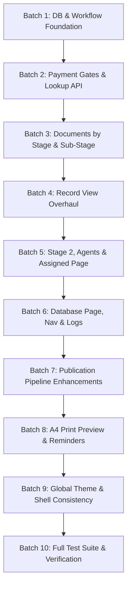

# Brandex Database CMS V2 Workflow & UI Architecture Audit

**Report Date:** 22 September 2026  
**Status:** Audit & Implementation-Readiness Inspection Complete (Read-Only)  
**Target Repository:** `Brandex-Database-CMS`  
**Primary App:** `artifacts/tm-tracker`  
**Primary Database:** Supabase Postgres  
**Author:** AI Pair Programming Architect (Antigravity)

---

## 1. Executive Summary

This architecture audit evaluates the entire Brandex Database CMS repository to prepare for the **V2 Workflow & UI Update**. The current system is a React 19/Vite single-page application backed by Supabase Postgres, with asynchronous Google Sheet mirroring via Supabase Edge Functions.

### Key Audit Findings:
1. **Production Baseline is Healthy:** Automated tests (`vitest`), TypeScript typecheck (`tsc`), and production bundle generation (`vite build`) are all currently passing with 0 errors.
2. **Current Workflow is Unrestricted:** Stages (`STAGE 1` through `STAGE 4`, plus `STOPPED`) and their sub-stages can currently be arbitrarily selected or reversed at any time via an unconstrained HTML dropdown in `RecordModal.tsx`. No payment gates or stage prerequisites are enforced.
3. **Stage 1 Sub-Stages are Incomplete:** `STAGE 1` currently contains only `["Acknowledgment", "Examination"]`. The mandatory first sub-stage, **"Filing"**, is missing from the workflow schema.
4. **Stage Payments are Entirely Unpersisted:** The four stage payment checkboxes and date inputs in `RecordView.tsx` exist only as transient component `useState`. They are not saved to Supabase and vanish on page refresh. No payment lookup API exists.
5. **Stage Documents are Disconnected:** Although the `trademark-files` private storage bucket and `public.trademark_files` table exist, the table is completely unused by the application. Only a single trademark logo/image is uploaded and saved to `trademarks.logo_path`. There is no capability to attach, list, or download documents by stage or sub-stage.
6. **Agent Assignments are Free Text:** In the trademark record, `agent` is an unconstrained string, not a foreign-key link to the `public.agents` master table.
7. **Client Code is Unvalidated:** `client_code` is stored as an unvalidated string on `trademarks`. While a master `public.clients` table exists, there is no foreign-key constraint.
8. **Print View Lacks Reminders & Dynamic Workflow:** The print preview directly prints the screen view without stage-specific reminder blocks (Reminder 1–4) or dynamic stage context.

---

## 2. Current Architecture

```
                                +---------------------------+
                                |  Staff Browser (Desktop)  |
                                +-------------+-------------+
                                              |
                     +------------------------+------------------------+
                     | (HTTPS / WSS)                                   | (Signed URLs)
                     v                                                 v
        +----------------------------+                     +-----------------------+
        |  Supabase Postgres DB      |                     | Supabase Storage      |
        |  - RLS (viewer/editor/admin|                     | Bucket:               |
        |  - RPCs (Match Engines)    |                     |   `trademark-files`   |
        |  - Triggers (Audit/Outbox) |                     +-----------------------+
        +--------------+-------------+
                       | (DB Trigger enqueues rows)
                       v
        +----------------------------+
        |  `sheet_sync_outbox`       |
        +--------------+-------------+
                       | (Polled via cron / HTTP Bearer)
                       v
        +----------------------------+
        |  Supabase Edge Function    |
        |  `sync-google-sheet`       |
        +--------------+-------------+
                       | (HTTPS POST mirrorUpsert/Delete)
                       v
        +----------------------------+
        |  Google Apps Script        |
        |  Brandex Google Sheet      |
        +----------------------------+
```

### Component & File Mapping:
- **Root Workspace:** `package.json`, `pnpm-workspace.yaml`.
- **Frontend App:** `artifacts/tm-tracker/`
  - **Entry Point:** `src/main.tsx`, `src/App.tsx` (Wouter routing, TanStack Query provider, `AuthGate`).
  - **Global Layout:** `src/components/layout/AppShell.tsx`, `src/components/layout/Navbar.tsx`.
  - **Data Layer / API:** `src/lib/api.ts` (1,080 lines), `src/lib/supabase.ts`.
  - **Registry & Import:** `src/lib/registryImport.ts`, `src/components/RegistryImportModal.tsx`.
  - **Pages:**
    - `src/pages/Dashboard.tsx` (`/`)
    - `src/pages/SearchPage.tsx` (`/search`)
    - `src/pages/DatabasePage.tsx` (`/database`)
    - `src/pages/AssignedPage.tsx` (`/assigned`)
    - `src/pages/AgentsPage.tsx` (`/agents`)
    - `src/pages/PublicationPipelinePage.tsx` (`/publication`)
    - `src/pages/RecordView.tsx` (`/record/:id`)
    - `src/pages/LogsPage.tsx` (`/logs`)
- **Backend / Migrations:** `supabase/migrations/` (8 ordered SQL migrations).
- **Edge Functions:** `supabase/functions/sync-google-sheet/index.ts`.
- **Google Apps Script:** `google-apps-script/Code.gs`.
- **One-time Scripts:** `scripts/import-google-sheet.mjs`.

---

## 3. Current Workflow

### Defined Stages & Sub-Stages (`src/lib/api.ts`):
```typescript
export const STAGES = ["STAGE 1", "STAGE 2", "STAGE 3", "STAGE 4", "STOPPED"] as const;

export const STATUS_WORKFLOW: Record<string, string[]> = {
  "STAGE 1": ["Acknowledgment", "Examination"],
  "STAGE 2": ["Assigned", "Accepted", "Hearing"],
  "STAGE 3": ["D-Note Submitted", "D-Note Received", "OPPO: Filed", "OPPO: Received", "OPPO: Withdrawn", "Published"],
  "STAGE 4": ["CER Dispatch", "CER Received", "CER Acknowledge"],
  "STOPPED": ["Case Stopped"],
};
```

### Stage Analysis:
1. **STAGE 1:**
   - **Current sub-stages:** `Acknowledgment`, `Examination`. (**"Filing" is missing**).
   - **Pages involved:** `DatabasePage.tsx`, `RecordModal.tsx`, `RecordView.tsx`, `Dashboard.tsx`.
   - **Status changes:** Free dropdown selection in `RecordModal.tsx`.
   - **Documents:** None attached. Only the overall logo image in `trademarks.logo_path`.
   - **Payments:** Transient checkbox in `RecordView.tsx` (`payments["STAGE 1"]`), never saved to database.

2. **STAGE 2:**
   - **Current sub-stages:** `Assigned`, `Accepted`, `Hearing`.
   - **Pages involved:** `AssignedPage.tsx`, `AgentsPage.tsx`, `RecordModal.tsx`, `RecordView.tsx`.
   - **Status changes:** Free dropdown selection in `RecordModal.tsx`.
   - **Documents:** None attached.
   - **Payments:** Transient checkbox in `RecordView.tsx`. No payment gate blocks entry to Stage 2.

3. **STAGE 3:**
   - **Current sub-stages:** `D-Note Submitted`, `D-Note Received`, `OPPO: Filed`, `OPPO: Received`, `OPPO: Withdrawn`, `Published`.
   - **Pages involved:** `PublicationPipelinePage.tsx`, `DatabasePage.tsx`, `RecordModal.tsx`, `RecordView.tsx`.
   - **Status changes:** Free dropdown selection in `RecordModal.tsx` or automated updates via `run_journal_match()`.
   - **Documents:** None attached.
   - **Payments:** Transient checkbox in `RecordView.tsx`.

4. **STAGE 4:**
   - **Current sub-stages:** `CER Dispatch`, `CER Received`, `CER Acknowledge`.
   - **Pages involved:** `DatabasePage.tsx`, `RecordModal.tsx`, `RecordView.tsx`.
   - **Status changes:** Free dropdown selection in `RecordModal.tsx`.
   - **Documents:** None attached.
   - **Payments:** Transient checkbox in `RecordView.tsx`.

5. **STOPPED:**
   - **Current sub-stages:** `Case Stopped`.

### Transition Mechanism & Jumps:
- **Arbitrary Jumps / Reverse Transitions:** **Fully allowed everywhere.** Any user with `editor` or `admin` role can open `RecordModal.tsx`, pick any stage from the `<select>` dropdown (e.g., jump from STAGE 1 directly to STAGE 4, or revert from STAGE 4 to STAGE 1), and save immediately.
- **Exceptional Workflow / Remand / Correction:** There is currently **no formal remand, appeal, or reopening mechanism**. Users handle exceptional operational changes simply by manually changing the stage dropdown.
- **Workflow Logging:** In migration `202609220002_trademark_workflow_history.sql`, any change to `status` or `sub_status` automatically creates an entry in `trademark_workflow_history`, capturing `from_status`, `from_sub_status`, `to_status`, `to_sub_status`, and `changed_by`.

---

## 4. Current Database Model

### Tables in Supabase Postgres:
1. `public.profiles` (`user_id` FK auth.users, `display_name`, `role` enum: `viewer`, `editor`, `admin`).
2. `public.clients` (`code` PK text, `name` text).
3. `public.trademarks`:
   - Primary: `id` (text PK, default gen_random_uuid()), `filing_date`, `type` ('X','A','N'), `client_code`, `client_name`, `case_number`, `application_name`, `tm_cpr_number`, `nice_class`.
   - Workflow: `status` ('STAGE 1'..), `sub_status`, `case_type`, `agent`, `city`, `notes`.
   - Form booleans: `tm5`, `tm6`, `tm11`, `tm16`, `tm56`.
   - Journal info: `journal_number`, `journal_date`, `journal_data` (jsonb).
   - Images: `logo_path` (text), `legacy_image_url` (text).
   - Concurrency: `version` (int), `updated_at`, `created_at`, `created_by`, `updated_by`.
   - Publication fields: `publication_date`, `opposition_deadline`, `demand_note_received`, `demand_note_date`.
4. `public.trademark_files`:
   - `id` (UUID PK), `trademark_id` (FK trademarks), `category` (`logo`,`application`,`tm5`,`tm6`,`tm11`,`tm16`,`tm56`,`journal`,`other`), `storage_path`, `file_name`, `mime_type`, `size_bytes`, `uploaded_by`, `created_at`.
   - **Missing columns:** `stage`, `sub_stage`, `title`, `description`.
5. `public.audit_logs`:
   - `id`, `trademark_id`, `action` ('CREATE','UPDATE','DELETE'), `changed_by`, `changed_at`, `old_record` (jsonb), `new_record` (jsonb).
6. `public.sheet_sync_outbox`:
   - `id`, `trademark_id`, `action` ('upsert','delete'), `payload` (jsonb), `state` ('pending','processing','synced','failed'), `attempt_count`, `last_error`, `created_at`, `processed_at`.
7. `public.form_registry`:
   - `id`, `serial_number`, `office`, `tm_number`, `tm_number_norm`, `nice_class`, `form_type`, `status`, `form_date`, `source_row`, `imported_at`, `imported_by`, `raw`.
8. `public.journal_registry`:
   - `id`, `journal_no`, `journal_date`, `application_no`, `application_no_norm`, `nice_class`, `applicant`, `agent`, `date_of_filing`, `generated_doc`, `source_row`, `imported_at`, `imported_by`, `raw`.
9. `public.agents`:
   - `id` (UUID PK), `name`, `city`, `phone`, `email`, `notes`, `is_active`, `created_at`, `updated_at`.
10. `public.agent_fees`:
    - `id` (UUID PK), `trademark_id` (FK trademarks), `agent_id` (FK agents), `description`, `amount_billed`, `amount_paid`, `fee_date`, `paid`, `paid_date`, `notes`, `created_by`, `created_at`, `updated_at`.
11. `public.agent_summary` (View):
    - Aggregates fees, billed, paid, balance, and unpaid entries per agent.
12. `public.trademark_workflow_history`:
    - `id`, `trademark_id`, `event_type`, `from_status`, `from_sub_status`, `to_status`, `to_sub_status`, `event_at`, `changed_by`.

---

## 5. Current Payment System

### Status: Missing in Database / UI State Only
- **Trademark Case Payments:** There are **no columns** in `trademarks` and **no dedicated stage payment table** in Postgres.
- **Frontend Implementation:** In `RecordView.tsx` (lines 53–59, 78–93, 302–335):
  ```typescript
  const [payments, setPayments] = useState<Record<string, { paid: boolean; date: string }>>({
    "STAGE 1": { paid: false, date: "" },
    "STAGE 2": { paid: false, date: "" },
    "STAGE 3": { paid: false, date: "" },
    "STAGE 4": { paid: false, date: "" },
  });
  ```
  This is purely in-memory React state. Refreshing the browser resets all payments to unpaid.
- **Payment Lookup API:** **Does not exist.** There is no function, endpoint, or RPC searching by `Trademark Number + Page + Date`.
- **Payment Gates:** **Does not exist.** A user can assign an agent or advance a record to Stage 2 even if no payment was ever received.
- **Agent Fees:** The only financial system that actually exists in Postgres is `public.agent_fees` (tracking legal counsel fees billed/paid), which is unrelated to client workflow stage payment verification.

---

## 6. Current Document System

### Status: Infrastructure Exists, Feature Unimplemented
- **Storage Bucket:** `trademark-files` (Supabase Storage) exists, configured for private access with 10MB limits and RLS policies for staff viewing and editor uploads.
- **Database Table:** `public.trademark_files` was created in migration 1, but is **never written to or read from** by any code in `src/`.
- **Existing Upload Function:** `uploadImage()` in `src/lib/api.ts` uploads files to `trademark-files/pending/{userId}/{uuid}.ext` and returns a signed URL. The resulting path is saved only to `trademarks.logo_path`.
- **Stage / Sub-Stage Link:** Files cannot currently be linked to stages or sub-stages because `trademark_files` lacks stage and sub-stage columns.
- **Record View Presentation:** `RecordView.tsx` only displays the main image and 5 boolean checkmarks for `TM5`–`TM56`. It does not show attached files, documents, or download links.

---

## 7. Current Agent System

### Components:
- **Master Table:** `public.agents` (managed via `AgentsPage.tsx`).
- **Fee Tracking:** `public.agent_fees` (linked to `trademark_id` and `agent_id`).
- **Computed View:** `public.agent_summary` (calculates `cases_with_fees`, `total_billed`, `total_paid`, `balance_due`, `unpaid_entries`).
- **API Functions:** `listAgentProfiles`, `createAgentProfile`, `updateAgentProfile`, `listFeesForTrademark`, `listFeesForAgent`, `addAgentFee`, `updateAgentFee`, `deleteAgentFee`.

### Existing Gaps:
- In `trademarks`, `agent` is a raw text column, not a foreign key `agent_id`.
- In `RecordModal.tsx`, agent assignment is a free-text `<FormInput placeholder="Agent name" />` rather than a dropdown selecting from `public.agents`.
- In `AssignedPage.tsx`, cases are filtered by `status = 'STAGE 2'` and `sub_status = 'Assigned'`, but there is no check whether Stage 2 payment was cleared prior to assignment.

---

## 8. Current Publication System

### Components:
- **Registry Table:** `public.journal_registry` populated via admin CSV import in `RegistryImportModal.tsx`.
- **Match Engine RPC:** `public.run_journal_match()` matches normalized application numbers (`application_no_norm = regexp_replace(tm_cpr_number, '\D', '', 'g')`) and updates:
  - `journal_number`, `journal_date`, `publication_date`, `opposition_deadline` (date + 2 months), `journal_data` (jsonb).
- **Publication Pipeline Page:** `src/pages/PublicationPipelinePage.tsx` lists records with `publication_date IS NOT NULL`, shows countdown days to opposition deadline, and tracks `demand_note_received` and `demand_note_date`.

### Existing Gaps:
- Does not group by Journal Number / release edition.
- Does not provide an overarching release summary (e.g. Total applications matched in Journal No. X, publication month).

---

## 9. Current Print System

### Implementation:
- Implemented in `src/pages/RecordView.tsx` (`#record-view-body`) combined with `@media print` rules in `src/index.css`.
- Uses browser print dialog (`window.print()`).
- Hides navbar, action buttons, and footer (`print:hidden`).
- Forces dark blue typography (`#0A1931`) and brand accents on pure white background.

### Existing Gaps:
- Does not automatically adapt to current workflow stage.
- Lacks the **four reminder blocks** (`Reminder 1`, `Reminder 2`, `Reminder 3`, `Reminder 4`).
- CEO Brandex Signature is an empty horizontal rule line (`border-b-2 h-16`), not an authentic brand mark / signature container.
- Does not display standard prefix formatting (A / X / N) prominently alongside case number and client code.

---

## 10. Current Logs

### Implementation:
- Trigger `trademarks_audit_and_sync` on `public.trademarks` automatically logs `CREATE`, `UPDATE`, and `DELETE` events into `public.audit_logs`.
- Frontend page `src/pages/LogsPage.tsx` displays audit rows with columns:
  `TIMESTAMP`, `USER`, `ACTION`, `RECORD`, `CHANGES`.
- `summarizeValue` in `LogsPage.tsx` extracts changed keys from JSON diffs.

### Existing Gaps:
- The user requested 8 distinct compact columns:
  1. Date
  2. Time
  3. User
  4. Action
  5. Record
  6. Application Number
  7. Name
  8. Changes
- Currently, Date and Time are merged into one column (`TIMESTAMP`), and Application Number and Application Name are buried inside the JSON changes summary rather than surfaced in explicit table columns.

---

## 11. Current UI / Theme

### Implementation:
- Style system in `src/index.css` using Tailwind CSS v4 and custom brand tokens:
  - Cream: `#F0E8D0`, `#E8DFC7`
  - Maroon: `#6C1C1F`
  - Gold: `#B0740E`
  - Deep Black: `#0C0C0C`
  - Teal/Green: `#0A6B52`, `#0D9970`
- Fonts: `Bebas Neue` (display/serif), `Space Grotesk` (sans), `DM Mono` (mono).

### Inconsistencies Identified:
- `RecordView.tsx` introduces navy/dark-blue tokens (`#0A1931`, `#1E3E62`, `#3A506B`) that do not match the maroon/gold/cream theme on other pages.
- Border widths and shadow offsets are inconsistently styled (mixing `border-2`, `border-3`, `shadow-[3px_3px_0_#0C0C0C]`, `shadow-[4px_4px_0_#0C0C0C]`, `shadow-[5px_5px_0_#0C0C0C]`, and `shadow-xl`).
- Shell layout: `AppShell.tsx` renders a top header (`Navbar.tsx`) and bottom contact footer, but has **no Sidebar component**, even though `src/components/ui/sidebar.tsx` is installed in the UI library.

---

## 12. Gap Analysis

| Feature Area | Current State | Required V2 State | Gap Severity |
| :--- | :--- | :--- | :--- |
| **Workflow Progression** | Unrestricted dropdown jumps between any stages/sub-stages | Strict forward flow (1→2→3→4); controlled progression | **HIGH** |
| **Stage 1 Sub-stages** | `["Acknowledgment", "Examination"]` | `["Filing", "Acknowledgment", "Examination"]` | **HIGH** |
| **Payment Gates** | Transient React state in `RecordView` (unpersisted) | Persistent DB gates (Stage 1–4); Stage 2 gate blocks progression | **CRITICAL** |
| **Payment API Lookup** | Does not exist | Lookup by TM No + Page + Date; auto-clears stage gate | **HIGH** |
| **Stage Documents** | `trademark_files` table unused; only 1 logo stored | Every stage/sub-stage can upload, view, download files | **HIGH** |
| **Agent Selection** | Raw text input on trademarks | Dropdown from `agents` master table; foreign key or synced ID | **MEDIUM** |
| **Assigned Page** | Shows Stage 2 Assigned, no payment gate awareness | Shows Stage 2 Assigned only when Stage 2 payment is cleared | **MEDIUM** |
| **Client Code** | Free text on trademarks, no DB foreign key | Standardized client code dropdown/autocomplete from `clients` | **MEDIUM** |
| **Database Page Columns** | Date, Image, Modified, Type, Client Code, Case No, TM/CPR, Class, App Name... | Date, Image, Application Name, Stage, Sub-stage, then remaining | **LOW** |
| **Logs Table Columns** | Timestamp, User, Action, Record, Changes (5 columns) | Date, Time, User, Action, Record, App No, Name, Changes (8 columns)| **LOW** |
| **Print Preview** | Raw body print, no reminder blocks, empty signature line | A4 layout, dynamic stage data, 4 reminder blocks, CEO signature | **MEDIUM** |
| **Theme Consistency** | Mixed navy/blue with maroon/cream, varied shadows | Unified Neo-Brutalism brand shell across all screens | **LOW** |

---

## 13. Required Database Changes

To be implemented in future migrations (no files created now):

### Migration 1: Stage Payment Gates & Records
- **Target Table:** `public.trademarks`
- **Columns to Add:**
  - `stage1_paid` (boolean, not null default false)
  - `stage1_paid_date` (date)
  - `stage2_paid` (boolean, not null default false)
  - `stage2_paid_date` (date)
  - `stage3_paid` (boolean, not null default false)
  - `stage3_paid_date` (date)
  - `stage4_paid` (boolean, not null default false)
  - `stage4_paid_date` (date)
  - `payment_verified_at` (timestamptz)
  - `payment_reference` (text)
- **Table to Add (Optional dedicated lookup table):**
  - `public.payment_registry` (`id uuid`, `tm_number_norm text`, `page_number text`, `payment_date date`, `stage text`, `amount numeric`, `raw jsonb`, `matched_at timestamptz`)
- **Indexes:**
  - Index on `(stage1_paid, stage2_paid)`
  - Index on `payment_registry(tm_number_norm, page_number, payment_date)`

### Migration 2: Document Attachments by Stage & Sub-Stage
- **Target Table:** `public.trademark_files`
- **Modifications:**
  - Add column `stage` (text not null default 'STAGE 1')
  - Add column `sub_stage` (text)
  - Add column `title` (text)
  - Add column `notes` (text)
  - Add index on `(trademark_id, stage, created_at desc)`
  - Update RLS policies to allow authenticated staff to read, editors/admins to insert/delete stage documents.

### Migration 3: Workflow Validation & Stage 1 Sub-Stages
- **Target:** Postgres trigger or constraint on `public.trademarks`
- **Rules:**
  - Prevent transition to `STAGE 2` if `stage2_paid = false` (enforce gate).
  - Add check constraint or trigger ensuring valid stages (`STAGE 1`, `STAGE 2`, `STAGE 3`, `STAGE 4`, `STOPPED`).
  - Update `trademark_workflow_history` trigger to capture user metadata and payment gate status.

### Migration 4: Relational Agent & Client Linkage
- **Target Table:** `public.trademarks`
- **Modifications:**
  - Add column `agent_id` (UUID references public.agents(id) on delete set null)
  - Index on `trademarks(agent_id)`
  - Backfill existing `agent_id` by matching `trademarks.agent` to `agents.name`.

---

## 14. Required API Changes (`src/lib/api.ts`)

1. **Update Workflow Definitions:**
   - Update `STATUS_WORKFLOW["STAGE 1"]` to `["Filing", "Acknowledgment", "Examination"]`.
2. **Add Payment Gate Types & API:**
   - Add stage payment fields to `TrademarkRecord` and `TrademarkInput`.
   - Add `updateStagePayment(id, stage, paid, date)`.
   - Add `lookupPayment(tmNumber, page, date)` to query external/internal payment registry.
   - Enforce gate validation in `updateTrademark`: prevent advancing to `STAGE 2` if `stage2_paid` is false.
3. **Add Stage Document Functions:**
   - `listDocumentsForTrademark(trademarkId, stage?)`: queries `trademark_files` joined with signed storage URLs.
   - `uploadStageDocument(trademarkId, stage, subStage, file, title)`: uploads to `trademark-files/{trademarkId}/{stage}/...` and inserts into `trademark_files`.
   - `deleteStageDocument(fileId)`: deletes from storage and removes DB row.
4. **Agent Integration:**
   - Update `createTrademark` and `updateTrademark` to accept `agentId` and sync `agent` display name.
   - Update `listAgents()` to query active agents from `public.agents`.
5. **Audit Log Formatting:**
   - Update `listAuditLogs()` to parse and extract `application_name`, `tm_cpr_number`, `date`, and `time` as distinct top-level fields for table rendering.

---

## 15. Required UI Changes

1. **`RecordView.tsx`:**
   - **Header:** Application Name, TM number, Prefix (A/X/N), Case No, Client Code.
   - **Status & Progression:** Clear visual stepper showing STAGE 1 (Filing → Acknowledgment → Examination) → STAGE 2 → STAGE 3 → STAGE 4.
   - **Stage Payments Section:** Connect checkboxes and date pickers to persistent DB fields; display automated payment verification status.
   - **Document Management Section:** Document list grouped by stage/sub-stage with file upload, preview, download, and delete controls.
   - **Agent Detail:** Display assigned agent with phone/email and link to fee entries.
   - **Workflow History:** Compact chronological timeline (auto-condensing when >10 items).
2. **`RecordModal.tsx`:**
   - Change Agent field from free-text to dropdown populated from `listAgentProfiles()`.
   - Prevent jumping directly to Stage 2 if Stage 2 payment is unpaid.
   - Populate Stage 1 sub-stages as `["Filing", "Acknowledgment", "Examination"]`.
3. **`DatabasePage.tsx`:**
   - Reorder table columns: `DATE`, `IMAGE`, `APPLICATION NAME`, `STAGE`, `SUB-STAGE`, `TYPE`, `CLIENT CODE`, `CASE NO`, `TM/CPR`, `CLASS`, `CITY`, `TM FORMS`, `JOURNAL`, `MODIFIED`.
4. **`AssignedPage.tsx`:**
   - Filter cases where `stage = 'STAGE 2'` AND `sub_stage = 'Assigned'` AND `stage2_paid = true`.
   - Surface assigned agent details from `agents` master table.
5. **`PublicationPipelinePage.tsx`:**
   - Group matched publication records by `journal_number`.
   - Display summary headers per journal edition (Total applications matched, publication date, opposition window status).
6. **`LogsPage.tsx`:**
   - Restructure table into 8 compact columns: `Date`, `Time`, `User`, `Action`, `Record`, `App No`, `Name`, `Changes`.
7. **Print View:**
   - Format dedicated A4 print layout with prefix, case number, client code, dynamic stage workflow details, CEO signature block, and **four reminder blocks** (`Reminder 1` to `Reminder 4`).
8. **App Shell & Theme:**
   - Standardize all components to the Brandex Neo-Brutalism palette (Cream `#F0E8D0`, Maroon `#6C1C1F`, Gold `#B0740E`). Remove stray navy/blue styling from `RecordView.tsx`.

---

## 16. Required Automation

1. **Payment Verification Service:**
   - Scheduled Edge Function or cron job that checks pending trademark cases against payment records using `Trademark Number + Page + Date`.
   - Automatically sets `stageX_paid = true`, records `stageX_paid_date`, and logs payment verification to audit log.
2. **Stage 2 Gate Guard:**
   - Database trigger or backend constraint preventing any update that moves a trademark to `STAGE 2` unless `stage2_paid = true`.
3. **Registry Match Engine:**
   - Existing `run_journal_match()` and `run_form_match()` remain operable and role-guarded by `editor`/`admin`.

---

## 17. Testing Plan

### Existing Tests Passing:
- `api.test.ts` (9 tests)
- `registryImport.test.ts` (2 tests)
- Total: 11 tests passed. Typecheck: 0 errors. Build: 0 errors.

### New Tests to Add in V2:
1. **Workflow Progression Tests:**
   - Verify `STAGE 1` sub-stages (`Filing`, `Acknowledgment`, `Examination`).
   - Verify forward transition logic (prevent arbitrary stage skips without validation).
2. **Payment Gate Tests:**
   - Verify that updating to `STAGE 2` without `stage2_paid = true` throws a validation error.
   - Verify payment lookup function with `(tmNumber, page, date)`.
   - Verify persistent stage payment saving and loading.
3. **Document Attachment Tests:**
   - Test `uploadStageDocument` and `listDocumentsForTrademark` by stage and sub-stage.
   - Test document deletion and RLS permissions.
4. **Agent Integration Tests:**
   - Test agent assignment from master table.
   - Test fee calculation and case linking.
5. **Audit Log Tests:**
   - Test log parsing for 8-column layout (Date, Time, User, Action, Record, App No, Name, Changes).

---

## 18. Implementation Batches



### Batch 1: Database & Workflow Foundation
- Write migration for stage payment columns on `trademarks`.
- Update `STATUS_WORKFLOW` in `api.ts` (add `Filing` to Stage 1).
- Add stage payment fields to `TrademarkRecord` and `TrademarkInput`.
- *Verification:* `pnpm test && pnpm typecheck && pnpm build`.

### Batch 2: Payment Gates & Lookup API
- Add database trigger/constraint blocking `STAGE 2` when `stage2_paid = false`.
- Implement `updateStagePayment` and payment lookup by `(tmNumber, page, date)`.
- Unit tests for payment gate enforcement.
- *Verification:* `pnpm test && pnpm typecheck && pnpm build`.

### Batch 3: Documents by Stage & Sub-Stage
- Write migration adding `stage`, `sub_stage`, `title` to `public.trademark_files`.
- Implement `listDocumentsForTrademark`, `uploadStageDocument`, `deleteStageDocument` in `api.ts`.
- Add stage document upload/list component in UI.
- *Verification:* `pnpm test && pnpm typecheck && pnpm build`.

### Batch 4: Record View Overhaul
- Redesign `RecordView.tsx`:
  - Application Header (image, app name, prefix A/X/N, case no, client code).
  - Compact chronological Workflow History timeline.
  - Interactive Stage Payments (persistent DB updates).
  - Stage Documents list & upload drawer.
  - Compact Journal matching block.
- *Verification:* `pnpm test && pnpm typecheck && pnpm build`.

### Batch 5: Stage 2, Agents & Assigned Page
- Link `agent_id` to `public.agents`.
- Replace free-text agent input with searchable agent dropdown in `RecordModal.tsx`.
- Update `AssignedPage.tsx` to enforce Stage 2 payment cleared requirement.
- *Verification:* `pnpm test && pnpm typecheck && pnpm build`.

### Batch 6: Database Page, Navigation, & Logs
- Reorder columns in `DatabasePage.tsx`: Date, Image, App Name, Stage, Sub-stage...
- Update `LogsPage.tsx` to 8 compact columns (Date, Time, User, Action, Record, App No, Name, Changes).
- Verify navigation bar.
- *Verification:* `pnpm test && pnpm typecheck && pnpm build`.

### Batch 7: Publication Pipeline Enhancements
- Add release batch grouping by `journal_number` in `PublicationPipelinePage.tsx`.
- Add release summary header (Total matched, publication month).
- *Verification:* `pnpm test && pnpm typecheck && pnpm build`.

### Batch 8: A4 Print Preview & Reminders
- Add dynamic workflow stage detection to print layout.
- Add four reminder blocks (`Reminder 1` to `Reminder 4`).
- Add CEO Brandex Signature block.
- Refine print stylesheet in `index.css`.
- *Verification:* `pnpm test && pnpm typecheck && pnpm build`.

### Batch 9: Global Theme & Shell Consistency
- Unify color palette across all pages (eliminate stray navy/blue styling from `RecordView`).
- Standardize card borders, buttons, and badges.
- *Verification:* `pnpm test && pnpm typecheck && pnpm build`.

### Batch 10: Full Test Suite, Smoke Testing & Documentation
- Add comprehensive Vitest unit & integration tests covering all new workflows.
- Update `Progress.md` and documentation.
- Production build verification.

---

## 19. Risks & Dependencies

1. **Legacy Google Sheet Mirroring (`sync-google-sheet`):**
   - The Supabase outbox trigger enqueues the full `new_record` jsonb to Google Apps Script. Adding new columns to `trademarks` (such as `stage1_paid` or `agent_id`) will include these in the outbox payload. `google-apps-script/Code.gs` must ignore unrecognized fields rather than failing row updates.
2. **Existing Data with Unpaid Stage 2:**
   - 1,671 existing records imported from Google Sheets may currently be in `STAGE 2` with `stage2_paid = false`. Any new DB constraint must apply to **transitions** (updates where status changes to STAGE 2), not prevent reading or editing existing legacy records.
3. **Foreign Key Integrity:**
   - `client_code` and legacy `agent` strings contain historical entries not present in `clients` or `agents` master tables. Foreign keys must be optional (`NULLABLE` with `ON DELETE SET NULL`) to prevent breaking legacy rows.

---

## 20. Progress State

- **COMPLETED:**
  - Supabase Postgres foundation with RLS and Auth.
  - Image storage bucket `trademark-files`.
  - Audit logging and Google Sheet asynchronous outbox mirror.
  - Form and Journal registries with CSV import.
  - Match engine RPCs (`run_journal_match`, `run_form_match`) with role security.
  - Agent profiles and per-case fee tracking table & view.
  - Publication pipeline tracking opposition deadlines and demand notes.
  - Trademark workflow history trigger and table.
- **IN PROGRESS:**
  - Brandex Database CMS V2 Architecture Audit (this document).
- **NEXT:**
  - Batch 1: Database & Workflow Foundation (Stage payment schema, Stage 1 `Filing` sub-stage).
  - Batch 2: Payment Gate enforcement and lookup API.
  - Batch 3: Document attachments by stage & sub-stage.
- **FUTURE / PARKED:**
  - Advanced graphical dashboard analytics / chart redesigns.
  - Real-time websocket live streaming of audit logs.
  - Public trademark search endpoint.
- **OUT OF SCOPE:**
  - Express/Neon/mobile legacy stacks (permanently removed).
  - Bulk permanent deletion of records.
  - Replacing Supabase with direct Google Sheets read/write in the browser.

---

## 21. Permanent Verification & Git Checkpoint Rule

After each future implementation batch is coded, the following pipeline must be strictly followed before proceeding:
1. `pnpm test` → All unit and integration tests must pass.
2. `pnpm typecheck` → TypeScript compiler must report 0 errors.
3. `pnpm build` → Vite production bundle must build successfully.
4. Verify functionality in browser / test harness.
5. Git commit with descriptive message (`[Type] Brief description`).
6. Git push to `origin/main`.
7. Update `Progress.md`.
